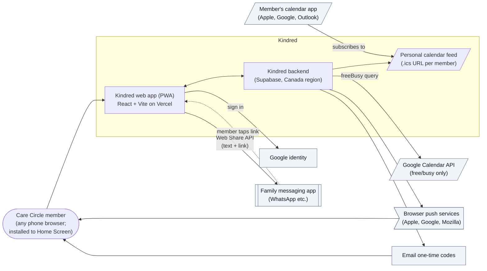
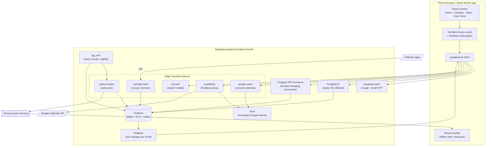
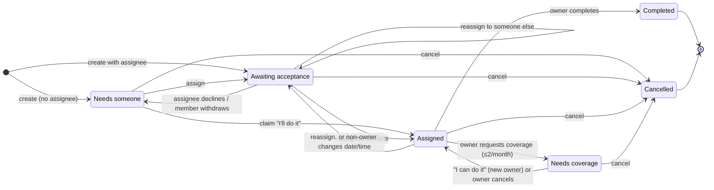
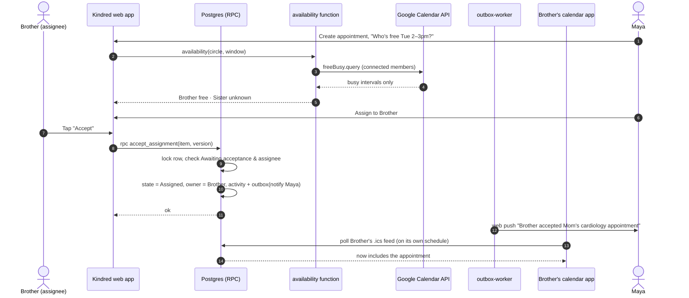
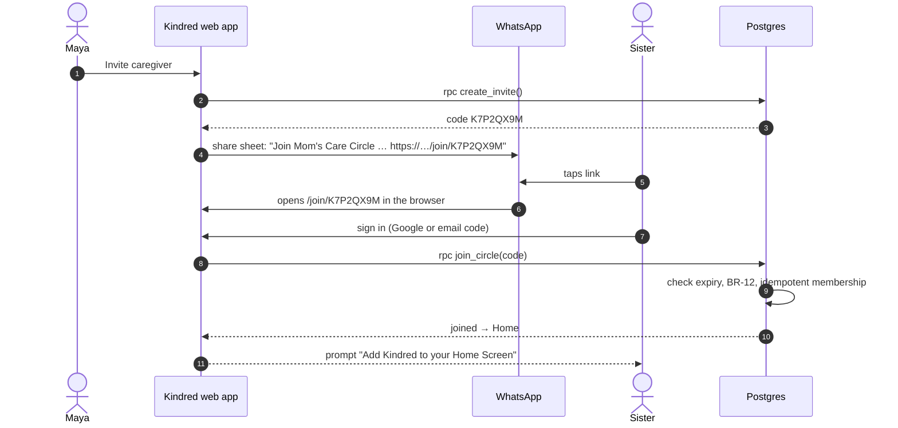
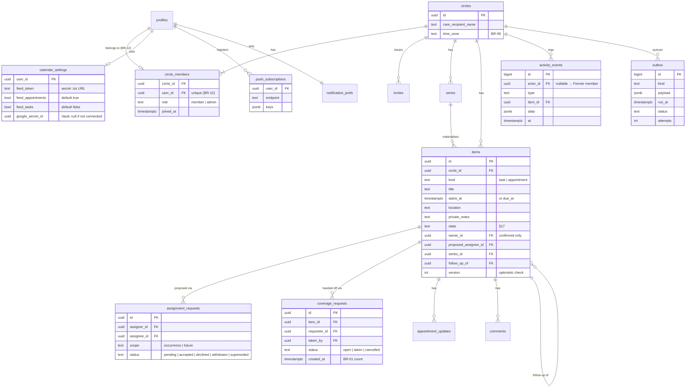
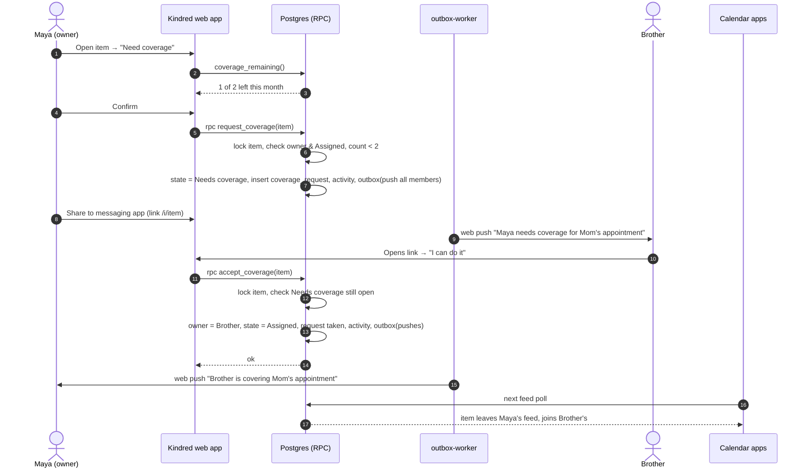

# Kindred — Architecture Decision Record (ADR)

Derived from [PRD.md](PRD.md) and [user-flow.md](user-flow.md). This document records the technical decisions for the Kindred MVP, why each was made, and what it costs us.

**Status:** Accepted for the buildathon prototype
**Date:** 2026-09-25
**Build window:** 3 weeks (Demo Day 2026-10-17); schedule and scope cuts are in [implementation-plan.md](implementation-plan.md)

---

## 1. Context and Drivers

Kindred is a mobile coordination layer for families sharing care. For the buildathon it must be a **working, demoable prototype** in 3 weeks, built by a small team on **free-tier services**. We choose the **easiest, simplest option** wherever the PRD allows. Where a shortcut creates a real risk later, it is called out under *Consequences*.

The PRD makes these requirements matter most to the architecture:

| Driver | Source | Architectural implication |
| --- | --- | --- |
| Mobile product for iOS and Android; no budget; judges must be able to try it | §1, §7.7 | Mobile-first web app now; native wrapper later from the same code |
| Passwordless sign-in | US 1.2 | Hosted auth provider with Google and email code (Apple later) |
| Assignment states must change atomically | §17 | Server-side transactional state transitions, not client writes |
| Only Care Circle members see circle data | BR-07, §26 | Authorisation enforced in the database, not only in the app |
| Free/busy without event details | BR-04, US 6.1 | Only free/busy answers are fetched; event details never reach Kindred |
| One-way sync of accepted items to the member's calendar | US 5.2, 8.3 | A calendar feed Kindred publishes; nothing is read back |
| Reminders only for confirmed, open items | US 11.2–11.3 | Server-scheduled push, evaluated at send time |
| Share via share sheet + links back into the item | Epic 9, US 1.2 | Web Share API; every item has a plain URL |
| Each recurring occurrence owned independently | BR-10 | Materialised occurrences, not computed on read |
| 2 coverage requests per calendar month | BR-01 | Counted from a request log in the circle's time zone |
| Canada launch, sensitive care data | §1, §26 | Data hosted in a Canadian region |
| Activity feed, success metrics | Epic 12, §30 | One append-only event log serves both |

---

## 2. Architecture Overview

### 2.1 System context



Kindred never talks to a messaging app's API (BR-06). It hands pre-filled text and a link to the phone's share sheet, and because the app is a website, the link opens the right item directly.

### 2.2 Containers



---

## 3. Decisions

Each decision uses the same shape: **Context → Decision → Alternatives considered → Consequences**.

### ADR-001 — Prototype platform: a mobile-first web app (PWA)

**Context.** The product is a mobile app for iOS and Android (§1). We have no budget, and judges need to be able to try it. We compared the ways to put a working prototype in front of judges:

| Option | Runs on | Cost | Push | Phone calendar access | Judges can try it |
| --- | --- | --- | --- | --- | --- |
| **Web app (PWA)** | Any phone or laptop browser | $0 | Yes, once added to the Home Screen (iOS 16.4+) | No — use a calendar feed and Google's API (ADR-008) | **Yes, by opening a URL** |
| Native iOS build | Registered iPhones | US$99/year Apple Developer account | Yes | Yes | Only on registered devices or via TestFlight |
| Native iOS, free Xcode signing | iPhones plugged into a Mac | $0 | **No** (not allowed without a paid account) | Yes | No; builds expire after 7 days |
| Expo Go | Phones signed in to the team's Expo account | $0 | Yes | **No** (`expo-calendar` isn't in Expo Go) | No |
| iOS Simulator | A Mac screen | $0 | Only faked (`simctl push`); real push needs a paid APNs key | **No** (`expo-calendar` supports real devices only) | No; screen demo only |
| Android build | Android phones or emulator | $0 | Yes | Yes | Only Android users |

**Decision.** Build a **mobile-first Progressive Web App** and demo it on phones installed to the Home Screen so it opens full-screen with its own icon and receives push. Judges can open the same URL on their own phones.

**Alternatives considered.** The iOS Simulator would work as a screen-share demo, but the two features that make Kindred more than a to-do list — push notifications and calendar integration — are exactly the two that don't work there. A native iOS build is the best experience but costs US$99 and Apple's lead times; it is the path after the buildathon (ADR-002).

**Consequences.** No app store, no developer accounts, no install links, and changes go live on every deploy. Web push on iPhone only works after "Add to Home Screen", so onboarding prompts for it. There is no access to the phone's own calendar, which shapes ADR-008.

---

### ADR-002 — Client stack: React + Vite + TypeScript, native later with Capacitor

**Context.** We want the simplest way to build a phone-shaped web app now without ruling out App Store and Play Store apps later.

**Decision.** **React + Vite + TypeScript**, with React Router, TanStack Query, Tailwind CSS and shadcn/ui (Radix-based, so accessible dialogs, menus and focus handling come built in). `vite-plugin-pwa` generates the manifest and service worker. Deployed on **Vercel**.

The path to native is **Capacitor**, which wraps an existing web app as an iOS and Android app and adds native plugins. These precautions keep that path short:

| Precaution | Why it keeps native open |
| --- | --- |
| Browser-specific features (share, push, "add to calendar", haptics) sit behind one `src/platform/` adapter | Swap each for a Capacitor plugin without touching screens |
| Mobile-only layout: 44px touch targets, safe-area insets, no hover-only interactions | The same UI works inside a native shell |
| All links are plain paths (`/i/<itemId>`, `/join/<code>`) | Map directly to Universal Links and App Links later |
| Auth, data and business rules live in Supabase, not in the client | A native shell reuses the backend unchanged |

**Alternatives considered.**
- *Expo (React Native) with a web target* — one codebase for native and web, but React Native Web adds layout quirks, and Expo's push library doesn't support web push, so we'd build that ourselves anyway. More friction for a web-first prototype.
- *Next.js* — its server features aren't needed; Supabase is our server. Vite is simpler to build and deploy.

**Consequences.** The team works in plain React and web tooling, which is the fastest to iterate on. A native release later needs Capacitor, the Apple and Google developer accounts, and native push and calendar plugins — but no rewrite.

---

### ADR-003 — Backend: Supabase (Postgres) in the Canada region

**Context.** We need auth, a relational database with transactions, row-level authorisation, realtime updates, scheduled jobs and a place for server code — without running servers, and on a free tier.

**Decision.** Use **Supabase** hosted in **Canada (Central)**: Postgres, Supabase Auth, PostgREST, Realtime, Edge Functions, pg_cron and Vault. Schema is managed as SQL migrations in the repo with the Supabase CLI; developers run the stack locally with `supabase start`.

**Alternatives considered.**
- *Firebase* — fast to start, but Firestore makes the atomic multi-row state transitions (§17), monthly counts (BR-01) and relational queries (calendar, feed, metrics) awkward.
- *Custom Node API + managed Postgres* — more control, but we'd rebuild auth, realtime and jobs, and most hosts need a paid tier to avoid cold starts.
- *Convex* — good realtime/transaction model, but less familiar and no Canadian region.

**Consequences.** Business rules live mostly in SQL (functions, RLS, constraints), which is fast to build and hard to bypass, but needs discipline: every rule gets a pgTAP test (ADR-014). Vendor lock-in is moderate — it is still plain Postgres.

---

### ADR-004 — Authentication: Supabase Auth, passwordless only

**Context.** US 1.2 requires Sign in with Apple, Sign in with Google, or an email one-time code.

**Decision.** Use **Supabase Auth**:
- **Google**: Supabase's standard web OAuth redirect, with only the basic `openid email profile` scopes, which need no Google app verification.
- **Email OTP**: a 6-digit code, not a magic link, so it works when email is read on another device and inside a Home Screen app. Supabase's built-in email only delivers to the project team's own addresses at 2 messages/hour, so outside testers need a custom SMTP provider (Resend free tier) and a domain (§5).
- **"Try the demo"** (for judges): Supabase **anonymous sign-in** creates a guest user and adds them to a pre-filled demo Care Circle. No email or Google account needed. Guest users get the same RLS rules as anyone else, and a nightly job removes them and resets the demo circle.
- **Apple**: added with the native app (ADR-002). Sign in with Apple on the web also needs the paid Apple Developer account, and the App Store rule that requires it only applies to native apps.

A `profiles` row is created by a trigger on `auth.users`. No passwords are stored.

**Consequences.** Signing in with Google grants no calendar access; connecting a calendar is a separate, optional step (ADR-008).

---

### ADR-005 — Authorisation: Row-Level Security scoped to the Care Circle

**Context.** BR-07: only members see circle data. BR-08: every member can edit every item; only administrators manage membership. BR-12: one circle per user.

**Decision.**
- Every circle-owned table carries `circle_id`. RLS policies allow `select` where `circle_id = current_circle_id()`, a stable SQL function that reads the caller's single membership.
- **Clients never `insert`/`update`/`delete` directly** on items, assignments or coverage tables. All writes go through `security definer` RPC functions (ADR-006) that check membership, enforce the rule and write the activity event.
- BR-12 is a unique constraint on `circle_members(user_id)`.
- Admin-only actions (remove member, grant admin) check `circle_members.role = 'admin'` inside their RPCs. Leaving as the last admin promotes the longest-standing member in the same transaction (US 2.2).

**Consequences.** Authorisation cannot be bypassed by a modified client. Reads stay simple (plain PostgREST queries). Moving to multiple circles per user later (P2) means changing `current_circle_id()` to a membership check.

---

### ADR-006 — Assignment state machine enforced in Postgres functions

**Context.** §17 defines six states and their transitions, and requires that concurrent actions (two people claiming the same task) cannot both succeed. The PRD also requires side effects on each transition (notify, update calendars, record activity).

**Decision.** Each user action is one RPC: `create_item`, `assign`, `accept_assignment`, `decline_assignment`, `withdraw_assignment`, `claim`, `request_coverage`, `cancel_coverage`, `accept_coverage`, `complete_item`, `cancel_item`, `update_item`. Each RPC:

1. Locks the item row (`select … for update`) and checks the current state and version.
2. Applies the transition, or raises a typed error (`already_claimed`, `assignment_no_longer_available`, `coverage_resolved`, `coverage_limit_reached`) that the app maps to the PRD's messages.
3. In the **same transaction**, appends to `activity_events` and to the `outbox` (notifications — ADR-009).



Account deletion (US 1.3) moves the deleted user's open `Assigned`/`Needs coverage` items to `Needs someone` through the same functions. **Overdue** is derived at read time (`due_at < now()` and state not terminal) and never stored.

**Alternatives considered.** Client-side state changes guarded by RLS — cannot express "only if still in state X" plus side effects atomically. An XState machine in an API server — nicer to read, but adds a server we don't otherwise need.

**Consequences.** The state machine lives in one migration file and is tested with pgTAP. The app stays thin: it calls an RPC and re-renders from Realtime.

---

### ADR-007 — Recurrence: materialise occurrences with a rolling horizon

**Context.** BR-10: each occurrence has its own assignment, coverage, completion, comments and updates. Only daily/weekly/monthly with optional end date. Edits apply to "this occurrence" or "this and future" (US 7.7).

**Decision.** A `series` row stores the rule (`freq`, `starts_at`, `until`). On creation we **insert real `items` rows** for each occurrence up to **90 days ahead**; a nightly pg_cron job extends every open series. Each item has `series_id` and `occurrence_index`.
- *This occurrence*: update the one item.
- *This and future*: end the old series at this occurrence, create a new series from here, and apply the change to its materialised items.
- *Assign all future occurrences*: one assignment request row covering the occurrence range; acceptance sets the owner on each covered item in one transaction (US 7.6).

**Alternatives considered.** Computing occurrences on read (RRULE expansion) with exception rows — the standard calendar approach, but every per-occurrence fact (owner, state, comments) would need exception rows, which is exactly the complexity BR-10 creates.

**Consequences.** Simple queries and a uniform state machine. Series with no end date are bounded by the horizon, so storage stays small.

---

### ADR-008 — Calendar integration: a subscribable feed out, Google free/busy in

**Context.** P0 needs calendar connection, free/busy (BR-04), and one-way sync of accepted items (US 5.2, 8.3). A web app can't read or write the phone's own calendar, so every option goes through a calendar provider or a standard file format. All provider APIs below are **free to use**; the differences are effort and approval hurdles.

| Option | Covers | Effort | Hurdles |
| --- | --- | --- | --- |
| **Subscribable `.ics` feed** (write only) | Apple, Google, Outlook — any calendar app | **About half a day.** One endpoint that renders the member's accepted items | None. Calendar apps poll on their own schedule (Apple: user setting; Google: every few hours) |
| **Google Calendar API — free/busy** | Google calendars | **About 2 days.** OAuth "Connect" flow, token storage, one `freeBusy.query` call | Unverified apps: up to 100 users, a "Google hasn't verified this app" screen, and in Testing mode access expires after 7 days. Verification (privacy policy, domain, demo video) is free but takes days to weeks |
| Google Calendar API — write events | Google calendars | About 2 more days (create/update/delete, handoffs, retries) | Same as above, with a broader scope (`calendar.events`) |
| Microsoft Graph (Outlook) | Outlook / Microsoft 365 | **About 3–4 days.** Azure app registration, OAuth | Graph's free/busy call (`getSchedule`) **doesn't support personal Outlook.com accounts**, so we'd read full events and compute busy times ourselves — which means seeing event details BR-04 says we shouldn't need |
| iCloud (CalDAV) | Apple calendars | Highest | No REST API; users must create an app-specific password |

**Decision.** The two cheapest pieces that meet the PRD:

1. **Sync out — a personal `.ics` feed.** Each member gets a secret URL (`/cal/<token>.ics`) served by the `calendar-feed` function. It lists items they have **accepted** (appointments by default; tasks if they opt in — US 5.2) with title, time and a Kindred link only. "Add to my calendar" opens the subscription in Apple Calendar (`webcal://`) or Google Calendar. Handoffs, reschedules and cancellations (US 8.3) need no extra work: the next time the calendar app polls, the item has moved to the new owner's feed. Regenerating the token revokes the old URL.
2. **Availability in — Google free/busy.** "Connect Google Calendar" runs a web OAuth flow in the `google-oauth` function requesting only the free/busy scope; the refresh token is stored encrypted in **Supabase Vault**. The `availability` function calls `freeBusy.query` and returns only `free | busy | unknown` per member per slot. Google returns busy times without titles, so event details never reach Kindred (BR-04). Results are cached for 5 minutes and not stored. Members who don't connect — including iCloud-only users — show as **Unknown**, as the PRD already allows.



**Consequences.**
- Calendar apps refresh subscribed feeds on their own timetable, so an accepted appointment can take minutes (Apple, if set to refresh often) to hours (Google) to appear. The app itself is always current, which is where people accept and hand off.
- Google verification is the gate to real users, and it needs a domain we own. For the buildathon we have no custom domain, so the Google app is set to **In production but unverified**: anyone can sign in (basic scopes need no verification), and connecting a calendar shows Google's "unverified app" screen, capped at 100 users. Testing mode is avoided because it limits sign-in to listed test users and expires access every 7 days.
- Outlook is deferred (P2 in the PRD). The feed already works in Outlook; only its availability is missing.
- **Native path:** once the app is wrapped with Capacitor (ADR-002), a native calendar plugin can read and write the phone's calendar directly — covering iCloud and Outlook with no provider APIs.

---

### ADR-009 — Side effects via a transactional outbox

**Context.** Notifications call external services that can fail or be slow. They must be sent if and only if the state change commits.

**Decision.** RPCs insert rows into an `outbox` table (`kind`, `payload`, `run_at`, `attempts`, `status`) in the same transaction as the state change. The `outbox-worker` Edge Function is triggered by a database webhook on insert and by pg_cron every minute (catch-up and scheduled jobs). It claims rows with `for update skip locked`, performs the call, and retries with backoff up to 5 attempts.

Job kinds: `push`, `reminder`, `unanswered_24h`.

**Alternatives considered.** Sending pushes from the app after an RPC returns (lost if the tab closes mid-flight); a queue service such as SQS (another vendor for no gain at this scale).

**Consequences.** One worker, one table, easy to inspect during the demo (`select * from outbox where status = 'failed'`).

---

### ADR-010 — Notifications: Web Push, scheduled server-side, privacy-safe copy

**Context.** Epic 11 requires assignment, reminder, coverage and update notifications with per-category preferences, no reminders before acceptance or after completion, and no sensitive details on the lock screen.

**Decision.**
- Use standard **Web Push** (VAPID keys) delivered through each browser's push service. The service worker shows the notification and opens the linked item when tapped. Subscriptions are stored in `push_subscriptions`.
- On iPhone, web push requires the app to be **added to the Home Screen** (iOS 16.4+). Onboarding shows a short "Add to Home Screen" guide before asking for notification permission.
- **Reminders are scheduled on the server.** When an item becomes `Assigned`, a `reminder` job is written with `run_at = due_at − lead time`. The worker **re-checks the item at send time** (still `Assigned`, same owner, same due time) and drops stale jobs. This satisfies US 11.2–11.3 even after reassignments, coverage or completion.
- The 24-hour "still awaiting acceptance" reminder (US 7.8) is an `unanswered_24h` job with the same check-at-send rule.
- Before sending, the worker applies the recipient's category preferences (§21 table). **Requests** are always visible in-app regardless (US 11.4), so members who never enable push still see them on Home.
- **Copy is generic**: e.g. "Mom's Care Circle — an appointment update was added". Update text, notes and comments are never in the payload; the notification carries only an item ID.

**Consequences.** Push reaches only members who installed the app to their Home Screen and allowed notifications; everyone else relies on in-app indicators and the messaging-app shares. With Capacitor later, the same outbox sends native push instead.

---

### ADR-011 — Links, sharing and invitations

**Context.** Epic 9 shares items through the OS share sheet with a link back into the correct item; invitations must work for people who don't have Kindred yet (US 1.2); links must respect BR-07.

**Decision.**
- **Share:** the **Web Share API** (`navigator.share`, supported by Safari on iOS and Chrome on Android) with pre-filled text built from the item (title, date, state; private notes excluded unless the user opts in; appointment update text never included — US 9.4, 9.5). Where it isn't available (desktop), the app offers "Copy link" and a `wa.me` WhatsApp link.
- **Links** are ordinary app URLs: `/i/<itemId>` and `/join/<inviteCode>`. Item links contain only an opaque ID; opening one loads the item through RLS, so non-members see "You don't have access" (US 9.1).
- **Invitations:** `invites` rows hold a random 8-character code, expiry (14 days) and circle. Because the link *is* the app, "invited before installing" (US 1.2) needs no special handling: the link opens the web app, the person signs in, and `join_circle(code)` adds them. They can add it to their Home Screen afterwards. `join_circle` is idempotent for existing members and enforces BR-12.



**Consequences.** The hardest part of mobile linking (deferred deep links before install) disappears. When we go native, the same paths become Universal Links and App Links (ADR-002).

---

### ADR-012 — Data model

**Context.** The model must cover circles, items (tasks and appointments), assignments, coverage with a monthly limit, updates, comments, calendar connections and feeds, notifications and an attributable activity history — and survive account deletion as "Former member" (US 1.3).

**Decision.** Tasks and appointments share one `items` table with a `kind` column; they have the same state machine and differ only in a few fields. Coverage allowance is **counted, not stored**: `count(*) from coverage_requests where requester = me and created_at` falls in the current month in the circle's time zone (BR-01 includes cancelled requests; the count resets naturally each month with no job). Authors on shared content are nullable; a `null` author renders as "Former member".



**Consequences.** One table and one state machine for both item kinds keeps the Calendar and Tasks tabs as two queries over the same data. Every change is attributed in `activity_events`, which satisfies BR-08 and feeds the activity feed. The calendar feed needs no table of its own: each event's ID is the item ID, so calendar apps update or remove it when the item changes.

---

### ADR-013 — Activity feed and product metrics from one event log

**Context.** Epic 12 (P1) needs a chronological feed; §30 lists activation and engagement metrics. We have no time to integrate an analytics SDK well.

**Decision.** `activity_events` is append-only and written only by RPCs. The Home feed reads it directly (RLS-scoped). Success metrics (acceptance rate, median time to accept, coverage resolution, circles with ≥2 active caregivers) are **SQL views** over `activity_events`, `items` and `coverage_requests`, queried from the Supabase dashboard. Messaging-app shares are logged by a `log_share` RPC after the share sheet resolves.

**Consequences.** No third-party analytics and no extra personal-data processor. Funnel steps before sign-in (opening an invite link without signing in) aren't captured; Vercel's request logs are enough for the demo.

---

### ADR-014 — Client data flow, repo layout and testing

**Decision.**
- **Reads:** TanStack Query over supabase-js, with types generated from the schema (`supabase gen types`). One Realtime channel per circle invalidates queries when `items`, `activity_events` or `comments` change, so every member sees acceptances and handoffs live — important for the demo.
- **Writes:** call the RPC, then optimistically update the cache; typed errors from ADR-006 map to the PRD's messages ("already taken", "coverage already resolved").
- **Offline:** the service worker caches the app shell and last-seen data for reading; actions require a connection.
- **Strings:** all UI text goes through `i18next` with an `en-CA` catalogue from day one, so French (P1, required for Quebec) is a translation task, not a refactor.
- **Accessibility:** status is always shown as text plus colour (§25); shadcn/ui's Radix components handle focus and ARIA; text uses `rem` units so it follows the browser's text-size setting.
- **Repo layout:**

```
web/                React + Vite PWA
  src/routes/       home, calendar, tasks, circle, i/:itemId, join/:code
  src/platform/     share, push, add-to-calendar (swap for Capacitor later)
supabase/
  migrations/       schema, RLS, RPCs, cron jobs
  functions/        google-oauth, availability, calendar-feed, outbox-worker, account
  tests/            pgTAP tests for the state machine, RLS and BR-01
docs/               PRD, user flow, ADR
```

- **Testing priority:** (1) pgTAP tests for every state transition, the concurrent-claim race, BR-01 counting and RLS isolation between two circles; (2) Vitest tests for the `.ics` renderer, share-text builders and error mapping; (3) a scripted manual demo run on two phones. No end-to-end UI automation in 3 weeks.
- **Environments:** local (`supabase start` + `vite`) and one hosted `demo` project; Vercel preview deploys for every PR. GitHub Actions runs migrations and pgTAP on every PR.

---

### ADR-015 — Account export and deletion

**Context.** US 1.3 (P0): export my data; delete my account, disconnect my calendar, return my open items to Needs someone, keep shared history as "Former member".

**Decision.** The `account` Edge Function:
- **Export:** builds a JSON file of the user's profile, preferences, memberships and content they authored, which the browser downloads or hands to the share sheet.
- **Delete:** in order — revoke the Google token and delete it from Vault → invalidate the calendar feed token → run `release_items_for_departing_member()` (open items → Needs someone, members notified) → null out author/actor references → delete push subscriptions, the profile and the `auth.users` row.

**Consequences.** Keeping "Former member" content follows the PRD's current assumption; switching to hard deletion is a change to one function if privacy review decides otherwise.

---

## 4. Key Runtime Flow — Coverage Handoff

Ties ADR-006, 008, 009, 010 and 011 together for PRD §29.



A second person tapping **I can do it** a moment later finds the row no longer in `Needs coverage` and gets `coverage_resolved` with the new owner (US 8.2).

---

## 5. Costs

**The prototype runs at $0.** Every service below has a free tier that covers a buildathon with a handful of test families. Limits are as published in September 2026.

| Service | Used for | Free tier (relevant limits) | Enough for the prototype? |
| --- | --- | --- | --- |
| Supabase Free | Database, auth, realtime, functions, cron, Vault | 500 MB database, 50,000 monthly active users, 5 GB egress, 500,000 Edge Function calls, 200 concurrent realtime connections, 2 projects; **paused after 1 week without activity**; no backups | Yes — far beyond our load. Keep it active in the days before the demo |
| Vercel Hobby | Hosting the web app, preview deploys | Free for non-commercial use; a `*.vercel.app` address works | Yes |
| Google Cloud | OAuth client for sign-in; Calendar API for free/busy | No charge for either; unverified apps allow up to 100 users of sensitive scopes | Yes |
| Web Push | Notifications | Browser push services (Apple, Google, Mozilla) don't charge | Yes |
| GitHub Actions | CI (migrations + pgTAP) | Free minutes cover this usage | Yes |

**Optional costs, only if we choose them:**

| Item | Cost | When it's needed |
| --- | --- | --- |
| Custom domain | ≈ CA$15–25/year | **Decided against for the buildathon.** Needed later for Resend and Google verification |
| Resend (email OTP to non-team addresses) | Free: 3,000 emails/month, 100/day — needs a verified domain | Only if testers outside the team sign in by email |
| Apple Developer Program | US$99/year | Native iOS app (Capacitor) or Sign in with Apple |
| Google Play Console | US$25 one-time | Native Android app on the Play Store |

**After the buildathon (pilot with real families):** Supabase Pro at about US$25/month per project (no pausing, daily backups, higher limits) and a domain. Google verification itself is free. Sentry has a free tier that would cover a pilot.

---

## 6. Risks and Follow-ups

| Risk | Impact | Mitigation |
| --- | --- | --- |
| iPhone web push needs "Add to Home Screen" | Members who skip it get no push | Onboarding guide; in-app indicators for requests; messaging-app shares |
| Google app unverified (no domain) | "Unverified app" screen when connecting a calendar; 100-user cap | Publish as In production (not Testing); connect demo accounts before the demo; buy a domain and verify after the buildathon |
| Calendar apps refresh the feed slowly (Google: hours) | Accepted items appear late in personal calendars | The app is the source of truth; show "Add to calendar" guidance; native calendar access with Capacitor later |
| iCloud and Outlook users have no availability | Shown as Unknown | Accepted in the PRD; native calendar plugin later covers both (ADR-008) |
| Supabase free project pauses after a week idle | Backend down on demo day | Use it daily; check the dashboard the day before the demo |
| Built-in email only reaches team addresses | Judges can't use email sign-in | Judges sign in with Google; email codes are for the team |
| Judges may expect an app-store app | Seen as "just a website" | Home Screen install looks and behaves like an app; show the Capacitor path (ADR-002) |
| Single time zone per circle (BR-09) | Wrong times for split-time-zone families | Store `timestamptz` everywhere and `circles.time_zone`, so P2 support is a UI change |

**Open PRD questions this ADR resolves or narrows**
- *On-device calendars for iCloud users* (§35) — not possible from a web app; iCloud users see a calendar feed but show as Unknown for availability until the native app (ADR-008).
- *Keep or delete shared content on account deletion* (§35) — both are cheap; implemented as "Former member" pending privacy review (ADR-015).

**Before real users (post-buildathon):** Google OAuth verification, a custom domain, native apps via Capacitor with Sign in with Apple, a privacy review against PIPEDA and provincial health-privacy laws, separate staging/production projects on a paid tier, error monitoring (e.g. Sentry), and French localisation.
