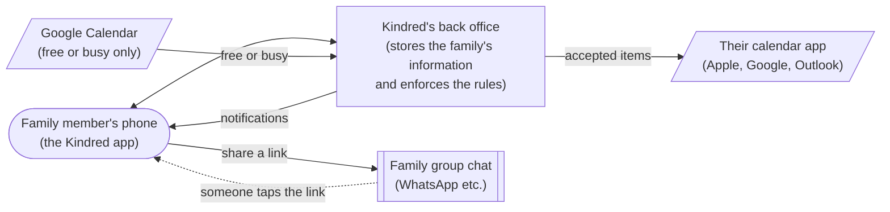
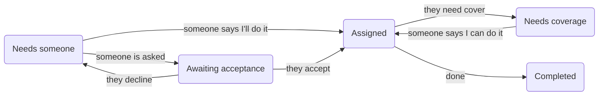

# How Kindred Is Built — A Plain-English Guide

This is a non-technical companion to the [Architecture Decision Record](ADR.md). It explains the main technical choices behind the Kindred prototype: what we chose, why, and what each choice means for families using the app. It's useful for anyone who needs to explain or defend those choices, for example to judges.

If this guide and the ADR ever disagree, the ADR is correct. A few technical terms are unavoidable; they're explained in the [glossary](#glossary) at the end.

---

## The big picture

Kindred is a **website that behaves like an app**. Family members open a link on their phone, and can add Kindred to their Home Screen so it opens full-screen with its own icon, just like an app from the App Store.

Behind the scenes there are three parts:

1. **The app on the phone:** what people see and tap.
2. **The back office:** a secure online service that stores each family's Care Circle and checks every action against the rules, for example that only the person who accepted a task can mark it complete.
3. **Connections to tools families already use:** their calendar app, their family group chat, and (optionally) Google Calendar to see who's free.

Kindred never reads family chats and never sees what's in anyone's personal calendar. It only sends links into the chat, and only asks Google whether someone is free or busy.

---

## The key decisions

### 1. A web app now, App Store apps later

**What we decided:** build Kindred as a website designed for phones, which people add to their Home Screen. Real App Store and Google Play apps come later, built from the same work.

**Why:**
- It costs nothing. Publishing on the App Store needs a US$99-a-year developer account and Apple's review process.
- Anyone can try it by opening a link, including judges on their own phones. There's nothing to download or approve.
- One website works on both iPhone and Android phones.
- Changes go live as soon as we publish them.

**Alternatives we ruled out:** a native iPhone app, which costs money and takes Apple's approval time; free iPhone test builds, which can't send notifications and expire after 7 days; and the iPhone simulator on a laptop, which can't do notifications or calendars for real.

**What it means:**
- Notifications on iPhone only work once Kindred is **added to the Home Screen**, so the app guides people through that step.
- A website can't read or write the calendar on the phone itself, which shapes how calendars work (decision 7).
- The code is organised so it can later be wrapped as a real App Store app without starting again.

### 2. A ready-made back office (Supabase), hosted in Canada

**What we decided:** use **Supabase**, a service that provides everything a back office needs (a database, sign-in, live updates, scheduled jobs) without us running our own servers. Kindred's data is stored in **Canada**.

**Why:** it's free for a prototype, it does the hard parts for us, and a Canadian data centre suits a Canadian launch with sensitive family information.

**Alternatives we ruled out:** Firebase (fast to start, but poorly suited to rules like "only one person can claim this"), building our own server (much more work), and Convex (less familiar, and no Canadian location).

**What it means:** most of Kindred's rules live in the back office, where they can't be bypassed. The free plan pauses a project after a week of no use, so we keep it active.

### 3. Signing in without passwords

**What we decided:** people sign in with **Google**, or with a **6-digit code sent by email**. There are no passwords. For judges there's also a **"Try the demo"** button that drops them straight into a sample family's Care Circle, with no account needed.

**Why:** fewer things to forget or get wrong, which suits family members who aren't confident with technology. A code works even if you read your email on a different device.

**What it means:**
- Because we haven't bought a web address of our own, Kindred's free email service can only send codes to the team. Everyone else, including judges, signs in with Google or uses Try the demo.
- **Sign in with Apple** comes with the App Store app, because on the web it also needs the paid Apple developer account.
- Signing in with Google doesn't give Kindred access to anyone's calendar. That's a separate, optional step.

### 4. Only your family can see your family's information

**What we decided:** privacy is enforced **by the back office itself**, not just by the app. Every piece of information belongs to one Care Circle, and the back office only ever hands it to members of that circle.

**Why:** even if someone tampered with the app, they couldn't see another family's information. This is a PRD requirement (BR-07).

**What it means:**
- Each person belongs to one Care Circle, as the PRD requires for now.
- Every member can manage every task and appointment. Only administrators can remove members or make someone else an administrator.

### 5. "Who agreed to do it" is always right

**What we decided:** every action (assign, accept, decline, claim, hand off, complete) is handled as **one all-or-nothing step** in the back office. The back office checks the task is still in the right state before making the change.

**Why:** this is the heart of Kindred. If two siblings tap "I'll do it" at the same moment, exactly one of them gets it, and the other sees "already taken". A task can never end up with two owners, or be marked accepted when nobody accepted it.

**What it means:**
- Each task moves through clear stages: **Needs someone → Awaiting acceptance → Assigned → Completed**, with **Needs coverage** when someone hands it off and **Cancelled** when it's no longer needed.
- **Overdue** is a label shown alongside a stage, not a stage of its own.
- Every action is recorded in the family's history as it happens, and triggers the right notifications.

### 6. Repeating tasks: each one stands on its own

**What we decided:** when someone creates a repeating task, such as "Drive Mom to physio every Tuesday", Kindred creates **a separate entry for each Tuesday**, up to 90 days ahead, and keeps extending it.

**Why:** the PRD says each occurrence has its own owner, handoffs and notes. Different siblings can take different Tuesdays, and one week's handoff doesn't affect the others.

**What it means:** repeats are daily, weekly or monthly. Changes to a repeating item apply to one occurrence at a time in the prototype.

### 7. Calendars: sending out, and checking who's free

A website can't touch the calendar on your phone, so Kindred connects to calendars in two simple ways.

**Accepted items appear in your own calendar.** Each person gets a private calendar link they add once to Apple Calendar, Google Calendar or Outlook. After that, anything they've **accepted** shows up in their calendar automatically, and disappears if they hand it off.
- **Why:** it works with every calendar app, takes about half a day to build, and needs no approval from Apple or Google.
- **What it means:** calendar apps check for changes on their own schedule, from minutes (Apple, if set to refresh often) to a few hours (Google). Kindred itself is always up to date.

**Seeing who's free (Google Calendar only).** People can optionally connect their Google Calendar. Kindred then asks Google one question, "is this person free or busy at this time?", and Google answers without sharing any event details.
- **Why:** families can see who's likely available without exposing anyone's private calendar (BR-04).
- **What it means:**
  - People who don't connect Google Calendar, including anyone who only uses Apple's iCloud calendar, show as **Unknown**. That's allowed by the PRD.
  - Because Kindred is new and has no web address of its own, Google shows a **"Google hasn't verified this app"** screen when someone connects, and caps it at 100 people. That's fine for a prototype and is fixed later by getting the app verified.

**Alternatives we ruled out:** writing events directly into Google Calendar (more work, and more access than we need), Outlook's service (it can't answer "free or busy" for personal accounts without reading full events), and iCloud (no suitable way in). The future App Store app can read the phone's own calendar directly, which covers iCloud and Outlook.

### 8. Notifications that don't give away private details

**What we decided:** Kindred sends notifications through the phone's normal notification system when someone needs to respond: an assignment request, an acceptance, a coverage request or a reminder. Notifications are written in **general terms**, such as "Mom's Care Circle: an appointment update was added", so nothing sensitive appears on a locked screen.

**Why:** the PRD asks for actionable notifications that don't expose care details (Epic 11, privacy requirements).

**What it means:**
- Notifications are **only sent if the action actually happened**, and are retried if a send fails.
- Reminders are **checked again just before they're sent**, so nobody is reminded about a task they've handed off, or that's already done.
- On iPhone, notifications need Kindred on the Home Screen. People who skip that still see requests on Kindred's Home screen and in their family chat.

### 9. Sharing to the family chat, and joining with a link

**What we decided:** Kindred uses the phone's normal **Share** button to send a pre-written message and a link into WhatsApp or any other messaging app. Every task has its own link, and invitations are links too.

**Why:** families keep talking where they already do (BR-06). Kindred doesn't need permission from, or a connection to, any messaging service.

**What it means:**
- Tapping a link opens the right task in Kindred. People outside the Care Circle see "You don't have access".
- Invitations just work, even for people who've never used Kindred: the link opens the app, they sign in, and they're in. Invitation links expire after 14 days.
- Private notes are left out of shared messages unless the person chooses to include them.

### 10. How the information is organised

**What we decided:** tasks and appointments are stored together as one kind of item, with the same stages, rather than as two separate things. Coverage requests are **counted, not stored as a number**: Kindred counts how many a person has made this month.

**Why:** one kind of item keeps the Calendar and Tasks tabs simple and consistent. Counting means the "2 coverage requests per month" limit (BR-01) resets itself at the start of each month, with nothing to maintain.

**What it means:** if someone deletes their account, their past updates stay visible to the family as **"Former member"** (decision 13).

### 11. One history that also measures success

**What we decided:** every change is written to a single family history ("Maya asked Daniel", "Daniel accepted"). The same history is used to measure how Kindred is doing, for example how often assignments are accepted, and how quickly.

**Why:** it gives families the clear record the PRD asks for, and gives us success metrics without adding a separate analytics service that would also see family data.

**What it means:** we can't measure what happens before someone signs in, which is fine for a prototype.

### 12. Building it well

**What we decided:**
- **Live updates:** when one person accepts a task, everyone else's screen updates straight away, with no refreshing.
- **Offline:** the app can show what you last saw without a connection, but actions need a connection.
- **Ready for French:** all the app's words are kept in one place, so adding French (needed for Quebec) is a translation job, not a rebuild.
- **Accessible:** status is always shown in words as well as colour, text grows with the phone's text-size setting, and buttons are large enough to tap easily (target: WCAG 2.2 AA).
- **Tested:** every rule, such as "only one person can claim a task" and "2 coverage requests per month", has an automatic test that runs before any change goes live.

### 13. Exporting your data and deleting your account

**What we decided:** anyone can download a copy of their information. Deleting an account:
1. disconnects their calendar;
2. returns tasks they'd agreed to do to **Needs someone** and tells the family;
3. keeps their past updates visible to the family as **"Former member"**;
4. removes everything else about them.

**Why:** the PRD requires both (US 1.3). Keeping shared history as "Former member" is the current assumption, pending a privacy review, and is easy to change.

---

## What it costs

**The prototype costs $0.** Every service we use has a free plan that easily covers a prototype with a handful of test families.

| Service | What it does for Kindred | Cost now |
| --- | --- | --- |
| Supabase | The back office: stores information, sign-in, live updates | Free |
| Vercel | Hosts the app so people can open it | Free |
| Google Cloud | Sign in with Google, and free/busy checks | Free |
| Web push | Notifications | Free |
| GitHub | Stores the code and runs the automatic tests | Free |

**Costs we're choosing not to take on yet:**

| Item | Cost | When we'd need it |
| --- | --- | --- |
| Our own web address (domain) | About CA$15–25 a year | To email codes to anyone, and to get Google's approval |
| Apple Developer account | US$99 a year | For an App Store app and Sign in with Apple |
| Google Play account | US$25 once | For an Android app on Google Play |

**For a pilot with real families**, we'd move to Supabase's paid plan (about US$25 a month) for backups and to stop it pausing, and buy a domain.

---

## Known limitations

| Limitation | What people will notice | What we do about it |
| --- | --- | --- |
| iPhone notifications need Kindred on the Home Screen | People who skip that step get no notifications | The app guides them through it; requests also show in the app and in the family chat |
| Google hasn't verified Kindred yet | A "Google hasn't verified this app" screen when connecting a calendar; limited to 100 people | Tap through it for the prototype; get verified once we have our own domain |
| Calendar apps update on their own schedule | An accepted item can take a few hours to appear in Google Calendar | Kindred itself is always current |
| No free/busy for iCloud or Outlook calendars | Those people show as Unknown | Accepted in the PRD; the future App Store app can read phone calendars directly |
| The free back office pauses after a week unused | The app stops working until it's woken up | Use it regularly, especially before Demo Day |
| Email codes only reach the team | Judges can't sign in by email | Judges use Sign in with Google or Try the demo |
| It's a website, not an App Store app | Some may see it as "just a website" | Once on the Home Screen it looks and behaves like an app, and the App Store version is a planned next step |
| One time zone per family | Families spread across time zones may see times that are off | Allowed by the PRD for now; times are stored so this is easy to add later |

**Before real families use it:** get Google's approval and our own domain; release App Store and Google Play apps with Sign in with Apple; have the privacy approach reviewed against Canadian privacy and health-information laws; move to paid plans with backups; add error monitoring; and add French.

---

## Glossary

| Term | Meaning |
| --- | --- |
| **ADR** | Architecture Decision Record: the technical document this guide explains |
| **Back office** | The online service behind the app that stores information and enforces the rules. Here, that's Supabase |
| **Care Circle** | The family group coordinating care for one person |
| **Domain** | A web address you own, like kindred.ca. We're using a free Vercel address instead |
| **Free/busy** | Whether someone has something in their calendar at a given time, without saying what it is |
| **Home Screen** | The iPhone screen of app icons. Adding Kindred there makes it open like an app and lets it send notifications |
| **PRD** | Product Requirements Document: what Kindred should do. Codes like BR-01 (business rule) and US 1.3 (user story) point into it |
| **Web app** | An app that runs in the phone's web browser rather than being installed from an app store |
