# Kindred — Implementation Plan

How we build and deploy the Kindred prototype. The build must be complete and deployed by the **feature freeze on Tuesday 13 October 2026**, ahead of Demo Day on 17 October. Preparing for Demo Day itself (pitch, demo script, video, rehearsal) is outside this plan.

Read it with:
- [PRD.md](PRD.md): what the product does (user stories, business rules BR-01 to BR-12, §17 state model, §28–29 key flows)
- [user-flow.md](user-flow.md): the MVP flow as a diagram
- [ADR.md](ADR.md): how it's built (stack, data model, RPCs, integrations)
- [judging-criteria.md](judging-criteria.md): why the plan favours depth over breadth

**Status:** Draft for team review
**Date:** 2026-09-25
**Deadline:** feature freeze at the end of Tuesday 13 October 2026

---

## 1. Goal and strategy

**Goal:** by the feature freeze, a deployed app at a public `*.vercel.app` URL that:
1. runs the PRD §28 (normal coordination) and §29 (coverage) flows end to end on iPhones installed to the Home Screen, with real push notifications, a real messaging-app share and a calendar feed, and
2. lets someone outside the team open the URL, tap **Sign in with Google** or **Try the demo**, and use the same flows on their own phone.

**Strategy: depth over breadth.** The judging criteria ask for a *prototype* that someone else can experience, not an MVP, and there is no required feature list. So:

- Build the **core loop** end to end and make it solid first: **create → assign → accept → hand off (coverage) → share to the messaging app → complete**.
- Everything else in P0 comes after that, in a simplified form, and is cut in the order in §2 if time runs short.
- The two target flows (§3) decide what gets polished. Other screens only need to work.
- Where two options work, pick the **easiest and simplest** one (ADR §1).

## 2. Scope

### Tier 1: core flows (never cut)

These are the product thesis: acceptance vs. assignment, atomic transitions, the coverage limit and sharing to the messaging app. The tier also includes what someone outside the team needs to get in.

| Capability | PRD | Notes |
| --- | --- | --- |
| Sign in: **Google** (prominent), email code (team only), **Try the demo** (anonymous) | US 1.2 | Google is how people outside the team sign in, since built-in email codes only reach team addresses. Apple is deferred to native (ADR-004) |
| Create a Care Circle, invite by link, join via `/join/<code>` | Epics 2–3, BR-12 | Invite shared through the share sheet |
| Home screen: today, awaiting my response, needs someone, coverage requests | §9 | Status always text + colour |
| Create task or appointment (title, date/time, location, private notes, optional assignee) | US 4.2, 7.1 | One create sheet for both kinds |
| Assign → **Accept / Decline** (one tap), **Claim** ("I'll do it"), **Complete** | US 7.2–7.5, BR-02, BR-03 | Atomic RPCs (ADR-006) |
| **Coverage**: "Need coverage — N of 2 remaining", confirm, "I can do it", limit-reached message | Epic 8, BR-01 | Counted in the circle's time zone |
| **Share to messaging app** (Web Share API) with a link to `/i/<itemId>` | Epic 9 | Private notes excluded by default |
| **Live updates** between phones (Realtime) | ADR-014 | Acceptances and handoffs appear on other members' phones without refreshing |
| **Web push** for assignment requests, acceptances and coverage | Epic 11, ADR-010 | Needs Home Screen install on iPhone |
| Installable PWA (manifest, icon, full-screen, "Add to Home Screen" guide) | ADR-001 | |
| **Calendar feed** (`.ics`): accepted items appear in the owner's calendar app | US 5.2, 8.3 | ~Half a day (ADR-008) |
| Appointment update + follow-up task | US 10.1–10.2 | Part of the §28 flow |
| Sample data and a reset script | — | So anyone trying the prototype lands on a realistic Care Circle |

### Tier 2: P0 in simplified form (build after Tier 1; cut in this order)

| Capability | Simplification | Cut order |
| --- | --- | --- |
| Recent activity on Home | Last 10 `activity_events`, no separate feed screen. Cheap because RPCs already write the events, and it shows the "who was asked → who accepted → what was completed" record (§28) | Cut 1st (it's P1) |
| Google Calendar connect + free/busy | One "Who's free?" check for the chosen slot in the create sheet. If cut, everyone shows **Unknown** | Cut 2nd |
| Reminders before due time | One fixed lead time (appointments 2 h, tasks 9 am on the due day), re-checked at send (ADR-010) | Cut 3rd |
| Recurrence | Daily / weekly / monthly create; edits apply to **this occurrence only** | "This and future" edits are not built |
| Withdraw, reassign, reschedule (BR-11) | Handled by `assign`, `withdraw_assignment` and `update_item` | Cut 4th |
| Calendar tab | An agenda list grouped by day, not a month grid | Keep (it's a list query) |
| Tasks tab | Filter chips: Mine · Awaiting me · Needs someone · All · Completed | Keep |
| Notification preferences | One on/off switch per §21 category | Cut 5th |
| Account export and deletion | Export JSON; delete per ADR-015 | Cut last |

### Tier 3: not in this build

Comments (P1), suggested caregivers and times (P1), sharing appointment updates (P1), French translation (strings still go through `i18next` so this stays a translation task), "this and future" recurring edits, "assign all future occurrences", the 24-hour unanswered reminder, Sign in with Apple, Outlook/iCloud availability, success-metric views.

---

## 3. Target flows

The build is judged done against these two flows from the PRD, run on real iPhones against the production URL. The names match the sample data (§8.5).

**Normal coordination (PRD §28):**
1. Maya creates "Mom's Care Circle" and shares an invite link to WhatsApp; Daniel and Priya open it, sign in and join.
2. Maya creates "Cardiology — Dr. Patel" and assigns it to Daniel (with "Who's free?" if Tier 2 free/busy is built).
3. Daniel gets a push, opens the item and taps **Accept**. Maya's phone shows **Assigned · Daniel** without refreshing.
4. The appointment appears in Daniel's calendar app through his subscribed feed.
5. Daniel adds an appointment update and creates a follow-up task, "Pick up prescription by Friday", assigned to Maya.
6. Maya accepts it, then marks it complete.

**Coverage (PRD §29):**
1. Maya opens an appointment she owns and sees **Need coverage — 1 of 2 remaining this month**.
2. She confirms, then shares the request to the WhatsApp group.
3. Daniel taps the link, the item opens, and he taps **I can do it**. Ownership moves to him, Maya gets a push, and the item moves from Maya's calendar feed to Daniel's.
4. If Priya taps **I can do it** a moment later, she sees that Daniel is already covering it.
5. After Maya's second request that month, a third attempt shows the limit-reached message.

---

## 4. Technical spec

The contracts every phase builds against, set up in task 0.3. When one changes, update this section in the same PR.

### 4.1 Data model

As in ADR-012, with these tables in the first migration: `profiles`, `circles`, `circle_members`, `invites`, `series`, `items`, `assignment_requests`, `coverage_requests`, `appointment_updates`, `comments` (table only; no UI), `calendar_settings`, `push_subscriptions`, `notification_prefs`, `activity_events`, `outbox`. Circle time zone defaults to `America/Vancouver`.

### 4.2 RPCs (all writes)

Clients never write tables directly (ADR-005). Every RPC checks membership, locks the row, checks `version`, writes `activity_events` and `outbox` in the same transaction, and returns the updated item (or the new ID).

| RPC | Arguments | Typed errors |
| --- | --- | --- |
| `create_circle` | `care_recipient_name`, `time_zone` | `already_in_circle` |
| `create_invite` | — → `code` | `not_member` |
| `join_circle` | `code` | `invite_expired`, `invite_not_found`, `already_in_other_circle` |
| `leave_circle`, `remove_member` | `member_id` (remove only) | `not_admin` |
| `create_item` | `kind`, `title`, `starts_at`, `ends_at?`, `location?`, `private_notes?`, `assignee_id?`, `repeat?` (`daily`/`weekly`/`monthly`), `until?`, `follow_up_of?` | `invalid_input` |
| `update_item` | `item_id`, `version`, `patch` (title, times, location, notes) | `stale_version`; a date/time change by a non-owner moves Assigned → Awaiting acceptance (BR-11) |
| `assign` | `item_id`, `version`, `assignee_id` | `stale_version`, `invalid_state` |
| `accept_assignment`, `decline_assignment` | `item_id`, `version` | `assignment_no_longer_available` |
| `withdraw_assignment` | `item_id`, `version` | `assignment_no_longer_available` |
| `claim` | `item_id`, `version` | `already_claimed` |
| `complete_item`, `cancel_item` | `item_id`, `version` | `not_owner` (complete), `invalid_state` |
| `coverage_remaining` | — → `int` | — |
| `request_coverage` | `item_id`, `version` | `not_owner`, `coverage_limit_reached` |
| `cancel_coverage` | `item_id`, `version` | `coverage_resolved` |
| `accept_coverage` | `item_id`, `version` | `coverage_resolved` (returns new owner name) |
| `add_appointment_update` | `item_id`, `body` | `not_member` |
| `log_share` | `item_id`, `share_kind` | — |
| `join_demo_circle` | — | For anonymous users only |
| `reset_demo_circle` | — | Service role only |

`web/src/lib/errors.ts` maps each error code to the PRD's user-facing message (e.g. `coverage_resolved` → "Daniel is already covering this").

### 4.3 Reads and live updates

- Reads are plain supabase-js queries over RLS-filtered tables, wrapped in TanStack Query hooks in `web/src/lib/queries.ts`.
- One Realtime channel per circle (`circle:<id>`) invalidates queries when `items`, `activity_events` or `coverage_requests` change.
- **Overdue** is computed in the client (`due < now` and state not Completed/Cancelled), never stored.

### 4.4 Edge Functions

| Function | Called by | Contract |
| --- | --- | --- |
| `outbox-worker` | DB webhook on `outbox` insert + pg_cron every minute | Sends `push` and `reminder` jobs; re-checks item state at send time |
| `calendar-feed` | Calendar apps, via Vercel rewrite `/cal/:token.ics` | Returns `text/calendar` for the member's accepted items |
| `google-oauth` | App ("Connect Google Calendar") | Redirect flow; stores refresh token in Vault |
| `availability` | App (create sheet) | `{circle_id, start, end}` → `{member_id: "free" \| "busy" \| "unknown"}` |
| `account` | App (Care Circle tab) | `export` → JSON; `delete` → ADR-015 order |

### 4.5 App routes and platform adapter

Routes: `/` (Home), `/calendar`, `/tasks`, `/circle`, `/i/:itemId`, `/join/:code`, `/sign-in`, `/welcome` (create circle + Home Screen guide).

`web/src/platform/` exposes: `share({text, url})`, `canShare()`, `isStandalone()`, `enablePush()`, `addCalendarFeed(url)`. Screens call these, never browser APIs directly (ADR-002).

### 4.6 Design tokens

All colours, radii, spacing and fonts live as CSS variables in `web/src/styles/tokens.css`, consumed by Tailwind and shadcn/ui. Each assignment state has a token pair (background + text) and a text label. The final brand is applied later by editing this file.

---

## 5. Build order

The only fixed date is the **feature freeze at the end of Tuesday 13 October**. After that, only bug fixes go in. Everything else runs as fast as the work allows.

The build runs in five phases. Within a phase, tasks that don't depend on each other run **in parallel**, each in its own git worktree and Claude Code session (§7.2). Each phase ends with a **checkpoint**: the phase's PRs are tested together on iPhones before the next phase starts.

```mermaid
flowchart LR
    subgraph P0["Phase 0 · Setup"]
        t01["0.1 Accounts"] --> t02["0.2 Scaffold + pipeline"] --> t03["0.3 Schema + skeleton"]
    end
    subgraph P1["Phase 1 · Foundations"]
        t11["1.1 Sign-in"]
        t12["1.2 Circles + invites"]
        t13["1.3 Shell + install"]
        t14["1.4 Push spike"]
    end
    subgraph P2["Phase 2 · Core loop"]
        t21["2.1 State machine"] --> t22["2.2 Create + item detail"]
        t21 --> t23["2.3 Home + live updates"]
        t24["2.4 Tasks + Calendar tabs"]
        t25["2.5 Local seed"]
    end
    subgraph P3["Phase 3 · Coverage, sharing, push, calendar"]
        t31["3.1 Coverage"]
        t32["3.2 Sharing"]
        t33["3.3 Push from outbox"]
        t34["3.4 Calendar feed"]
    end
    subgraph P4["Phase 4 · Finish and open up"]
        t41["4.1 Update + follow-up"]
        t42["4.2 Sample data + Try the demo"]
        t43["4.3 Care Circle tab"]
        t45["4.5 Tier 2 items"]
        t44["4.4 Design pass"] --> t46["4.6 Production check"]
    end
    t03 --> P1 --> M1{{"M1"}} --> P2 --> M2{{"M2"}} --> P3 --> M3{{"M3"}} --> P4 --> F{{"Feature freeze<br/>Tue 13 Oct"}}
```



### Checkpoints

Each checkpoint is tested on **real iPhones against the production URL** by the whole team (task T2). Bugs found go into a fix PR before the next phase starts.

| Checkpoint | Done when |
| --- | --- |
| **M1: Foundations** | Every team member has Kindred on their Home Screen, signed in (email code or Google), are in one Care Circle joined via a shared link, and see an (empty) Home. A test push has reached at least one iPhone. CI runs pgTAP on every PR |
| **M2: Core loop** | On two iPhones: create → assign → accept (live update on the other phone) → complete. Claim works. Two people claiming at once: one wins, the other sees "already taken" |
| **M3: Coverage** | The §3 coverage flow runs end to end, including the push and the WhatsApp share. Accepted items appear in a subscribed Apple Calendar |
| **Feature freeze** (end of Tue 13 Oct) | Both §3 flows run start to finish on three iPhones against production. A phone that has never used Kindred gets in with Google and with Try the demo. The deployment checklist (§8.4) is complete |

**Protecting the freeze.** Tier 2 work only starts once M3 passes. If M3 is reached with little time left, skip Tier 2 and use the time for the Tier 1 tasks in Phase 4 and for fixes. Whatever isn't merged and tested by the freeze is cut.

---

## 6. Phases and tasks

Each task is roughly **one GitHub issue, one worktree, one Claude Code session and one PR** (§7.1–7.2). Task IDs go in issue titles and worktree names (e.g. `2-1-state-machine`). "Runs alongside" lists the tasks it can be built in parallel with.

### 6.1 Phase 0: Setup and first deploy

| ID | Task | Runs alongside | Done when |
| --- | --- | --- | --- |
| 0.1 | **Accounts** (before the build starts): Supabase org + project in Canada (Central) with team emails added; Vercel Hobby linked to `Team-Claudia/kindred`; Google Cloud OAuth client with Calendar API enabled and consent screen **In production**; VAPID key pair generated. Secrets go in Supabase/Vercel settings and a shared password manager, never the repo | — | Every dashboard is reachable with the shared team account |
| 0.2 | **Scaffold and pipeline**: `web/` (Vite, React, TypeScript, React Router, TanStack Query, Tailwind, shadcn/ui, `vite-plugin-pwa`, `i18next`, Vitest), `supabase/` (`supabase init`), `vercel.json` (SPA fallback + `/cal/:token.ics` rewrite), `.env.example`, a root **`CLAUDE.md`** with repo conventions (§4 and §7 of this plan, including "work from your GitHub issue; don't read the full PRD or ADR unless the issue links to a section"), `.claude/worktrees/` in `.gitignore`, and a `.worktreeinclude` listing `.env.local`, and GitHub Actions for CI and deployment (§8.2) | — | A "Hello Kindred" page is live on the production URL; CI is green |
| 0.3 | **Schema and skeleton**: first migration with all tables (§4.1) and RLS enabled; generated types; `errors.ts`; `api.ts` and `queries.ts` stubs; route skeletons; `tokens.css`; `platform/` interfaces (§4) | — | The migration is applied to the hosted project; every route renders a placeholder |

Phase 0 runs in one session, in order: everything after it builds on the scaffold and schema.

### 6.2 Phase 1: Foundations → M1

| ID | Task | Runs alongside | Done when |
| --- | --- | --- | --- |
| 1.1 | **Sign-in**: `profiles` trigger on `auth.users`; sign-in screen with "Continue with Google" first, "Try the demo" (wired up in 4.2), then "Email me a code"; auth redirect URLs for production and previews (§8.3) | 1.2, 1.3, 1.4 | Google and email code both work on an iPhone |
| 1.2 | **Circles and invites**: `current_circle_id()` and RLS policies; `create_circle`, `create_invite`, `join_circle` (idempotent, BR-12, 14-day expiry), `leave_circle` (last-admin promotion), `remove_member`; `/welcome` and `/join/:code` screens; invite shared through `platform/share` | 1.1, 1.3, 1.4 | pgTAP: circle X can't read circle Y; BR-12 enforced. An invite link opened from WhatsApp joins the circle |
| 1.3 | **App shell and install**: bottom nav (Home, Calendar, Tasks, Care Circle), safe-area insets, 44 px targets, `StatusBadge` (text + colour per state), loading/empty/error states; PWA manifest and icons; **Add to Home Screen guide** | 1.1, 1.2, 1.4 | Installs to the Home Screen and opens full-screen at the default and largest text sizes |
| 1.4 | **Push spike** (de-risks ADR-010 early): service worker `push` handler, `enablePush()` in standalone mode, `push_subscriptions`, and a bare Edge Function that sends a test push | 1.1, 1.2, 1.3 | A test push arrives on a Home Screen install |

### 6.3 Phase 2: Core loop → M2

| ID | Task | Runs alongside | Done when |
| --- | --- | --- | --- |
| 2.1 | **State machine** (ADR-006): `create_item`, `assign`, `accept_assignment`, `decline_assignment`, `withdraw_assignment`, `claim`, `complete_item`, `cancel_item`, `update_item` (with BR-11), each writing `activity_events` and `outbox` rows | 2.4, 2.5 | pgTAP for every transition in PRD §17 and the concurrent-claim race |
| 2.2 | **Create sheet and item detail**: create/edit (kind, title, date/time, location, notes, assignee); `/i/:itemId` with the right action buttons for the viewer and state; "You don't have access" for non-members; errors mapped via `errors.ts` | 2.3 (after 2.1 is merged) | Every §17 action is reachable in one tap from item detail |
| 2.3 | **Home and live updates**: today, awaiting my response, needs someone, coverage requests, upcoming; Realtime channel per circle invalidating queries | 2.2 (after 2.1 is merged) | An acceptance on one phone shows on the other within a couple of seconds |
| 2.4 | **Tasks and Calendar tabs**: filter chips (Mine · Awaiting me · Needs someone · All · Completed); agenda list grouped by day | 2.1, 2.5 | Both tabs list items with owner and status |
| 2.5 | **Local seed**: `supabase/seed.sql` with a circle, members and items in every state for development | 2.1, 2.4 | `supabase db reset` gives a usable app locally |

### 6.4 Phase 3: Coverage, sharing, push, calendar → M3

| ID | Task | Runs alongside | Done when |
| --- | --- | --- | --- |
| 3.1 | **Coverage**: `coverage_remaining`, `request_coverage`, `cancel_coverage`, `accept_coverage` (BR-01 per calendar month in the circle's time zone, cancelled requests included); UI with "Need coverage — N of 2 remaining this month", confirm step (≤ 2 taps), limit-reached message, "I can do it" | 3.2, 3.3, 3.4 | pgTAP: 3rd request in a month fails, resets on the 1st, a second "I can do it" gets `coverage_resolved` |
| 3.2 | **Sharing**: share-text builders for task, assignment, coverage, appointment and invite (private notes and update text excluded, US 9.4–9.5) with Vitest tests; Share button on item detail; "Copy link" and `wa.me` fallback; `log_share` | 3.1, 3.3, 3.4 | The share sheet opens on iPhone with the right text and link |
| 3.3 | **Push from the outbox**: `outbox-worker` (claim with `skip locked`, retries, generic copy per ADR-010), DB webhook + per-minute cron; `notificationclick` opens `/i/<id>`. Pushes for assignment requests, acceptances and coverage | 3.1, 3.2, 3.4 | A push reaches a Home Screen install within ~5 s of the action |
| 3.4 | **Calendar feed**: `calendar-feed` returns `.ics` of accepted appointments (tasks if opted in), event UID = item ID, secret token per member; "Add Kindred to my calendar" opens `webcal://` | 3.1, 3.2, 3.3 | Subscribed in Apple Calendar on an iPhone and shows the accepted item |

### 6.5 Phase 4: Finish and open up → feature freeze

| ID | Task | Runs alongside | Done when |
| --- | --- | --- | --- |
| 4.1 | **Appointment update and follow-up**: `add_appointment_update`; "Create follow-up task" from appointment detail (`follow_up_of`) | 4.2, 4.3, 4.5 | The §3 normal coordination flow runs end to end |
| 4.2 | **Sample data and Try the demo**: sample circle seed from T1 (§8.5); `join_demo_circle()` and `reset_demo_circle()`; anonymous sign-in behind "Try the demo"; nightly pg_cron reset and anonymous-user clean-up | 4.1, 4.3, 4.5 | A new phone taps Try the demo and lands on a populated Home; `reset_demo_circle()` restores the sample circle in under a minute |
| 4.3 | **Care Circle tab**: members (admin: remove), invite, calendar feed link, notifications on/off, leave circle | 4.1, 4.2, 4.5 | Every item in the tab works or is hidden |
| 4.4 | **Design-application pass**: apply the final colours, type, spacing and icons through `tokens.css`; match layouts to final screens; check WCAG 2.2 AA contrast for every state badge | Nothing: it touches every screen, so run it alone once the other Phase 4 screens are merged | Screens match the designs |
| 4.5 | **Tier 2, in order, as time allows** (§2): recent activity on Home → Google connect + free/busy → reminders → recurrence → withdraw/reassign/reschedule UI → notification preferences → account export/delete. Each item is its own task | 4.1, 4.2, 4.3, and each other | Whatever isn't done by the freeze is cut |
| 4.6 | **Production check**: work through the deployment checklist (§8.4) | — | Checklist complete |

### 6.6 Team tasks (not code)

| ID | Task | Needed by |
| --- | --- | --- |
| T1 | **Sample data content** (`docs/sample-data.md`): the family, care recipient, 10–15 items across states and two weeks of history, following the outline in §8.5, turned into seed SQL in 4.2 | Task 4.2 |
| T2 | **Checkpoint testing** at M1, M2, M3 and the freeze: the team runs the checkpoint's steps (and later the §3 flows) on their own phones. Log bugs in the team chat or `docs/qa-notes.md` with phone, steps and screenshot | Each checkpoint |

---

## 7. How we work with Claude Code

### 7.1 Tasks as GitHub issues

Each task in §6 becomes a GitHub issue, and each Claude Code session works from its issue rather than from the documents. The issue carries everything the task needs, so the session doesn't have to read the PRD, ADR and this plan in full. Together they're about 30,000 tokens, and once a session reads a document it's resent with every later turn.

- **One issue per task**, using the template in `.github/ISSUE_TEMPLATE/task.md`. It has these sections:
  - **Task:** what to build, from the task table.
  - **Done when:** the task's "Done when", as a checklist.
  - **Depends on / runs alongside:** links to the other task issues.
  - **Context:** the PRD, ADR and plan passages the task needs, copied in full.
  - **Links:** to the full sections, if the excerpts aren't enough.
  - **Checks before the PR:** the list from §7.3.
- **Titles and labels:** titled `<ID> <name>` (e.g. "1.2 Circles and invites") and labelled `task` plus the phase (`phase-1`).
- **Create a phase's issues when the phase starts**, not all up front, so the copied context matches the current documents. Claude Code can do this with a prompt like: *"Create the GitHub issues for Phase 2 from `docs/implementation-plan.md` using the task issue template. Copy in only the context each task needs."*
- **The documents stay the source of truth.** If the PRD, ADR or this plan changes, update any open issue that quotes the changed text.
- **A PR closes its issue** with `Closes #N` in its description.

### 7.2 Parallel sessions with worktrees

Each task issue runs in its own **git worktree** (a separate copy of the repo on its own branch) with its own Claude Code session, so tasks from the same phase can be built at once. Claude Code creates the worktree itself: open a terminal in the repo and run

```sh
claude --worktree 1-1-sign-in
```

This creates `.claude/worktrees/1-1-sign-in/` on a new branch `worktree-1-1-sign-in` from the latest `main`, and starts the session inside it. Open another terminal and run the same command with another task ID to start a second session in parallel. (In the Claude Code desktop app, choose the worktree option when starting a session instead.) Task 0.2 adds `.claude/worktrees/` to `.gitignore` and a `.worktreeinclude` file listing `.env.local`, so each new worktree gets the local settings automatically.

Start each session with something like:

> Read `CLAUDE.md` and GitHub issue #N (`gh issue view N`). Work from the issue; open a linked document section only if something you need is missing. Implement this task only. Install dependencies, add tests, run the checks listed in the issue, and open a PR that says what changed and how to try it, with `Closes #N`.

Because `CLAUDE.md` and the issue hold the conventions and the context, every session can start without earlier context, and anyone on the team can continue a task. When you exit a session, Claude Code offers to remove the worktree; keep it until its PR is merged. To go back into a kept worktree, run `claude --worktree 1-1-sign-in --resume`.

**Keeping parallel sessions out of each other's way:**
- **Start with two sessions at a time**, and add a third only if usage allows (§7.5).
- **Only one local Supabase stack can run at a time**, because the worktrees share the same project settings. Run the local database in one worktree; sessions in the other worktrees rely on CI to run pgTAP.
- **Merge database changes first.** When two PRs both change the schema, merge one, then have the other session rebase on `main` and regenerate `database.types.ts`. Screens that need new RPCs wait until those RPCs are merged, because previews use the hosted database, which only gets migrations from `main` (§8.2).
- Migrations use the Supabase CLI's timestamped names, so two branches never pick the same file name. Never edit a merged migration; add a new one.
- Change the spec in §4 (RPC arguments, error codes, table columns) in the same PR that changes the code.
- No secrets, team names or email addresses in the repo.

### 7.3 Checks before a PR is opened

PR review is a quick scan, not a line-by-line technical review, so the checks have to be automatic. Before opening a PR, each session:
1. Runs typecheck, lint, Vitest, the build and (if it changed the database) pgTAP, and fixes any failures.
2. Runs `/code-review` on its own changes and fixes what it finds.
3. Confirms state changes happen only through RPCs, with no direct table writes from the app, and that new user-facing text goes through `i18next` (`en-CA`).
4. Writes a PR description in plain language: which task it closes, what changed, and how to try it on a phone.

The PR is then scanned for anything surprising, and merged once CI is green.

### 7.4 Testing in batches

PRs aren't tested on a phone one by one. Instead:
- **Merge when CI is green.** Merging deploys to production, which is fine before the freeze because only the team uses it. Production may be briefly broken between checkpoints.
- **Test the batch at the checkpoint.** When every task in a phase is merged, the team runs the checkpoint (§5) on their iPhones against production. Bugs go into one fix PR, then the checkpoint is re-run.
- **Exception:** changes to push, Home Screen install and sign-in only fail on real devices, so try those on a phone straight after merging (tasks 1.1, 1.3, 1.4, 3.3 and 4.2).

**Local development:** `supabase start` and `npm run dev` in `web/`. Testers don't need a local setup; they use the production URL.

### 7.5 Usage limits

Claude Code on a Pro plan shares one allowance with the Claude app. The allowance resets every five hours, and there is also a weekly limit. Anthropic doesn't publish exact numbers; check what's left under **Settings → Usage** on claude.ai. Parallel sessions spend the allowance proportionally faster: two sessions use it about twice as fast as one.

**Making it last:**
- Use **Sonnet** (the default; switch with `/model`) for almost everything. Save Opus for a task that Sonnet gets stuck on.
- **One fresh session per task.** Long sessions resend the whole conversation on every turn, so they cost more per step.
- **Point sessions at sections, not whole documents.** The PRD alone is nearly 2,000 lines; the start prompt above points the session at its issue, which carries only the excerpts it needs (§7.1). Keep `CLAUDE.md` short, because it's sent with every turn.
- Ask Claude to **plan first** on bigger tasks (plan mode, `Shift+Tab`), so a wrong approach is caught before code is written.
- Check usage after Phase 1. If the weekly limit looks too tight for the remaining phases, drop to one session at a time, or decide on extra capacity (below).

**If a limit is reached mid-task,** the session stops until the limit resets, but nothing is lost: the files stay in the worktree and the conversation is saved. After the reset, run `claude --worktree <task> --resume` (or `claude --continue` inside the worktree) and say "continue". To make restarts cleaner, sessions commit to their branch after each working step. If time is too short to wait, the options are usage credits (pay-as-you-go at API rates, only switched on with explicit consent) or a Max plan; both break the $0 budget (ADR §5), so they're a team decision.

---

## 8. Environments and deployment

### 8.1 Environments

| Environment | Web app | Backend | Used for |
| --- | --- | --- | --- |
| Local | `npm run dev` | `supabase start` (Docker) | Building and pgTAP tests |
| Preview | Vercel preview per PR | Hosted Supabase project | Trying a PR on an iPhone |
| Production | Vercel production from `main` (`*.vercel.app`) | Hosted Supabase project (Canada Central) | Team testing and anyone trying the prototype |

There is one hosted Supabase project. The free tier allows two; the second is kept spare rather than used as staging.

### 8.2 Deployment pipeline (set up in task 0.2)

- **On every PR** (GitHub Actions): typecheck, lint, Vitest, build, and `supabase start` + `supabase db test` for pgTAP. Vercel builds a preview.
- **On merge to `main`** (GitHub Actions): `supabase db push` applies new migrations to the hosted project, then `supabase functions deploy` deploys the Edge Functions. Vercel deploys the web app to production.
- GitHub secrets: `SUPABASE_ACCESS_TOKEN`, `SUPABASE_PROJECT_REF`, `SUPABASE_DB_PASSWORD`.
- **Rollback:** revert the PR on `main`. For a bad migration, add a new migration that undoes it; never edit or delete a merged one.

### 8.3 Configuration

| Where | Setting |
| --- | --- |
| Vercel env vars | `VITE_SUPABASE_URL`, `VITE_SUPABASE_ANON_KEY`, `VITE_VAPID_PUBLIC_KEY` (same values for preview and production) |
| Supabase function secrets | `VAPID_PRIVATE_KEY`, `VAPID_SUBJECT`, `GOOGLE_CLIENT_ID`, `GOOGLE_CLIENT_SECRET`, `APP_URL` |
| Supabase Auth | Site URL = production URL; redirect URLs = production URL and the Vercel preview pattern; Google provider on; email OTP on (6-digit code); anonymous sign-ins on |
| Google Cloud | Authorised redirect URIs for Supabase Auth and the `google-oauth` function; consent screen **In production** |
| Database | pg_cron jobs (outbox catch-up every minute, recurrence extension and sample-circle reset nightly); DB webhook on `outbox` insert → `outbox-worker` |

### 8.4 Deployment checklist (task 4.6, before the freeze)

- [ ] Google OAuth consent screen is **In production** (not Testing); sign-in tested with a Google account outside the team.
- [ ] Anonymous sign-in rate limit raised in the Supabase dashboard (many people on one Wi-Fi network share an IP address).
- [ ] All migrations and functions on the hosted project match `main`; pg_cron jobs and the outbox webhook are active.
- [ ] `select * from outbox where status = 'failed'` returns nothing unexpected.
- [ ] The calendar feed URL works through the Vercel rewrite and subscribes in Apple Calendar.
- [ ] `reset_demo_circle()` runs cleanly on production.
- [ ] Supabase project used within the last week (free projects pause after a week idle; ADR §5).

### 8.5 Sample data

**Sample circle design.** Everyone who taps Try the demo joins one shared sample circle as a member, so the seed includes enough **Needs someone** items for many visitors to claim, and `join_demo_circle()` creates a few items **awaiting the new guest's acceptance**. A per-guest copy of the circle would stop visitors seeing each other's changes but is more work; revisit only if the shared circle proves confusing in testing. `reset_demo_circle()` restores it nightly and on demand.

**Outline for T1:** care recipient "Mom" (Margaret), time zone `America/Vancouver`, three fictional siblings (Maya, Daniel, Priya), a weekly "Drive Mom to physio" series, a cardiology appointment with an update and a follow-up task, a daily "Evening medication check", some completed history, and one coverage request already used by Maya this month (so the coverage flow shows "1 of 2 remaining").

The team's own circle is created through the app, not seeded.

---

## 9. Design hand-off

Designs arrive as work in progress. Layout and flow changes are expensive late on; colours and polish are cheap. So designs are needed in this order:

| Needed before | Design delivers | Why |
| --- | --- | --- |
| **Phase 2** | Screen structure (wireframes) for Home, item detail, create sheet, assign/accept, coverage, onboarding | Layout and flow drive the Phase 2 and 3 screens |
| **Phase 2** | Status badge styles for the six states + Overdue (text + colour, AA contrast) | Used on every screen |
| **Task 4.4** | Colours, type, spacing, icon set as tokens | Applied in the design pass |

Designs go in `docs/design/` as PNG exports or screenshots. Until they arrive, screens are built on default shadcn/ui styling. Constraints: phone-sized, safe-area insets, 44 px targets, status as text + colour, WCAG 2.2 AA (PRD §25).

---

## 10. Risks

Technical risks and mitigations are in ADR §6. Risks specific to this build:

| Risk | Mitigation |
| --- | --- |
| The build depends on one person running the sessions | `CLAUDE.md`, this plan and small PRs let anyone on the team continue a task in a fresh Claude Code session; accounts are owned by a shared team account |
| PR review is only a scan, so problems can slip through | Automatic checks before every PR (§7.3); business rules live in the database and are covered by pgTAP, whose test names can be read against the PRD rules |
| Batch testing finds bugs later than testing every PR | Batches are one phase long; device-only changes (push, install, sign-in) are tried on a phone straight after merging (§7.4) |
| Running out of time before the freeze | Parallel sessions within each phase; Tier 1 first; Tier 2 only after M3 and cut in order (§5) |
| Hitting Claude Code usage limits | Sonnet by default, one fresh session per task, short prompts pointing at sections; sessions commit as they go so a stopped task resumes cleanly (§7.5) |
| Web push on iPhone is fiddly (standalone mode, permission prompts, service-worker updates) | Push spike in Phase 1 (task 1.4), tried on a phone as soon as it's merged; Realtime updates on Home still show requests without push |
| A migration breaks the hosted database | pgTAP runs on every PR before merge; fixes go forward as new migrations; `reset_demo_circle()` restores sample data |
| Design lands late and forces layout changes | Wireframes needed before Phase 2; once Phase 4 starts, only token and polish changes |
| Visitors in the shared sample circle see each other's changes | Enough open items to claim; per-guest items from `join_demo_circle()`; nightly and on-demand reset |

---

## 11. Open items

- [ ] Team email list (private; needed for the Supabase organisation so email codes reach the team).
- [ ] Work-in-progress designs (§9).
- [ ] Confirm the reminder lead times in Tier 2.
