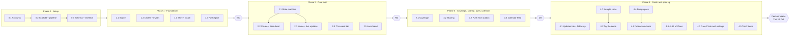

# Kindred — Implementation Plan

How we build and deploy the Kindred prototype. The build must be complete and deployed by the **feature freeze on Tuesday 13 October 2026**, ahead of Demo Day on 17 October. Preparing for Demo Day itself (pitch, demo script, video, rehearsal) is outside this plan.

Read it with:
- [PRD.md](PRD.md): what the product does (user stories, business rules BR-01 to BR-12, §17 state model, §28–29 key flows)
- [user-flow.md](user-flow.md): the prototype flow as a diagram
- [wireframes/README.md](wireframes/README.md): every screen, with the decisions of 2026-09-28
- [ADR.md](ADR.md): how it's built (stack, data model, RPCs, integrations)
- [judging-criteria.md](judging-criteria.md): why the plan favours depth over breadth

**Status:** Draft for team review
**Date:** 2026-09-25 (updated 2026-10-02 for Phase 4)
**Deadline:** feature freeze at the end of Tuesday 13 October 2026

---

## 1. Goal and strategy

**Goal:** by the feature freeze, a deployed app at a public `*.vercel.app` URL that:
1. runs the PRD §28 (normal coordination) and §29 (coverage) flows end to end on phones with the app installed to the Home Screen, with real push notifications, a real messaging-app share and a calendar feed, and
2. lets someone outside the team open the URL, tap **Sign in with Google** or **Try the demo**, and use the same flows on their own phone.

**Strategy: depth over breadth.** The judging criteria ask for a *prototype* that someone else can experience, not an MVP, and there is no required feature list. So:

- Build the **core loop** end to end and make it solid first: **create → assign → accept → hand off (coverage) → share to the messaging app → complete**.
- Everything else in P0 comes after that, in a simplified form, and is cut in the order in §2 if time runs short.
- The two target flows (§3) decide what gets polished. Other screens only need to work.
- Where two options work, pick the **easiest and simplest** one (ADR §1).

## 2. Scope

### Tier 1: core flows (never cut)

These are the product thesis: acceptance vs. assignment, atomic transitions, the coverage limit and sharing to the messaging app. The tier also includes what someone outside the team needs to get in.

| Capability | PRD | Notes |
| --- | --- | --- |
| Sign in: **Google** (prominent), email code, **Try the demo** (anonymous) | US 1.2 | Google is the main way in for people outside the team; email codes are sent through the team Gmail account (about 500 a day). Apple is deferred to native (ADR-004) |
| Create a Care Circle (with each member's relationship to the care recipient), invite by link, join via `/join/<code>` | Epics 2–3, BR-12 | Invite shared through the share sheet |
| Home screen: needs your answer (Accept / Decline), today (the whole family's), coming up for you, needs someone, coverage requests, latest update, counts labelled "This week" | §9 | Status always text + colour |
| Create task or appointment (title, date/time, location, private notes, optional assignee) | US 4.2, 7.1 | One create sheet for both kinds |
| Assign → **Accept / Decline** (one tap), **Claim** ("I'll do it"), **Complete** | US 7.2–7.5, BR-02, BR-03 | Atomic RPCs (ADR-006) |
| **Coverage**: "Need coverage — N of 2 remaining", confirm, "I can do it", limit-reached message | Epic 8, BR-01 | Counted in the circle's time zone |
| **Share to messaging app** (Web Share API) with a link to `/i/<itemId>` | Epic 9 | Private notes excluded by default |
| **Live updates** between phones (Realtime) | ADR-014 | Acceptances and handoffs appear on other members' phones without refreshing |
| **Web push** for assignment requests, acceptances and coverage | Epic 11, ADR-010 | Needs Home Screen install on iPhone |
| Installable PWA (manifest, icon, full-screen, "Add to Home Screen" guide) | ADR-001 | |
| **Calendar feed** (`.ics`): accepted items appear in the owner's calendar app | US 5.2, 8.3 | ~Half a day (ADR-008) |
| **Updates tab**: post an update linked to an item or to nothing; the thread; linked updates on item detail; follow-up task | US 10.1–10.2 | Part of the §28 flow. Text only, no @mentions |
| Sample data and a reset script | — | So anyone trying the prototype lands on a realistic Care Circle. Content drafted in task 4.7, reviewed by the team (T1) |

### Tier 2: P0 in simplified form (build after Tier 1; cut in this order)

| Capability | Simplification | Cut order |
| --- | --- | --- |
| **This week** tab | An agenda list grouped by day with previous/next week and a filter by member, not a month grid | Keep (it's a list query) |
| Map preview (P1) | Wireframes 18, 23. Geoapify via the `static-map` function; geocoded once per location (ADR-017). If cut, the location shows as text | Cut 1st |
| Weekly summary (P1) | Wireframe 14. `weekly_summary()` SQL function read on demand, fixed sentences, Sunday notification (ADR-016). If cut, the Summary tab is hidden | Cut 2nd |
| In-app notification list (P1) | Wireframe 29. Bell on Home, `notifications` table written by the outbox worker, mark all read (ADR-010) | Cut 3rd |
| Google Calendar connect + free/busy | One "Who's free?" check for the chosen slot in the create sheet. If cut, everyone shows **Unknown** | Cut 4th |
| Reminders and overdue alerts | One fixed lead time (appointments 2 h, tasks 9 am on the due day); overdue alert to owner and admins at the due time; both re-checked at send (ADR-010). Overdue alerts are P1 and can be cut on their own | Cut 5th |
| Recurrence | Daily / weekly / monthly create; edits apply to **this occurrence only** | "This and future" edits are not built |
| Withdraw, reassign, reschedule (BR-11) | Handled by `assign`, `withdraw_assignment` and `update_item`. **Built in task 2.2** (Withdraw, Reassign and Edit on item detail) | Done |
| Notification preferences | One on/off switch per §21 category | Cut 7th |
| Account export and deletion | Export JSON; delete per ADR-015 | Cut last |

The map, weekly summary, notification list and overdue alerts were added on 2026-09-28 from the wireframes. Together they're about 4–5 days of work, so they sit near the top of the cut order: the core loop and the rest of P0 come first.

### Tier 3: not in this build

Comments (P1), suggested caregivers and times (P1), sharing appointment updates (P1), a separate activity feed screen (replaced by Updates and the weekly summary), voice notes, @mentions, a photo of the care recipient, a wide laptop layout, French translation (strings still go through `i18next` so this stays a translation task), "this and future" recurring edits, "assign all future occurrences", the 24-hour unanswered reminder, Sign in with Apple, Outlook/iCloud availability, success-metric views.

---

## 3. Target flows

The build is judged done against these two flows from the PRD, run on real phones against the production URL. The names match the sample data (§8.5).

**Normal coordination (PRD §28):**
1. Maya creates "Mom's Care Circle" and shares an invite link to WhatsApp; Daniel and Priya open it, sign in and join.
2. Maya creates "Cardiology — Dr. Patel" and assigns it to Daniel (with "Who's free?" if Tier 2 free/busy is built).
3. Daniel gets a push, opens the item and taps **Accept**. Maya's phone shows **Assigned · Daniel** without refreshing.
4. The appointment appears in Daniel's calendar app through his subscribed feed.
5. Daniel posts an update linked to the appointment and creates a follow-up task, "Pick up prescription by Friday", assigned to Maya.
6. Maya accepts it, then marks it complete.

**Coverage (PRD §29):**
1. Maya opens an appointment she owns and sees **Need coverage — 1 of 2 remaining this month**.
2. She confirms, then shares the request to the WhatsApp group.
3. Daniel taps the link, the item opens, and he taps **I can do it**. Ownership moves to him, Maya gets a push, and the item moves from Maya's calendar feed to Daniel's.
4. If Priya taps **I can do it** a moment later, she sees that Daniel is already covering it.
5. After Maya's second request that month, a third attempt shows the limit-reached message.

---

## 4. Technical spec

The contracts every phase builds against, set up in task 0.3. When one changes, update this section in the same PR.

### 4.1 Data model

As in ADR-012, with these tables in the first migration: `profiles`, `circles`, `circle_members` (with `relationship`), `invites`, `series`, `items` (with `location_lat` / `location_lng`), `assignment_requests`, `coverage_requests`, `updates`, `comments` (table only; no UI), `calendar_settings`, `push_subscriptions`, `notification_prefs`, `notifications`, `activity_events`, `outbox`. Circle time zone defaults to `America/Vancouver`.

- **States** are stored in snake_case: `needs_someone`, `awaiting_acceptance`, `assigned`, `needs_coverage`, `completed`, `cancelled`. Their labels are in `en-CA.json` under `state`.
- **RLS** is on for every table. Task 0.3 adds no policies, so nothing is readable from the app until a task adds the policies it needs.
- **Circle policies** (task 1.2): `select` only, where `circle_id = current_circle_id()` on every circle-owned table, and on `profiles` for your own and your circle's members. `current_circle_id()` returns the caller's one circle. `outbox` has no policy.
- **Profiles:** a trigger on `auth.users` (`handle_new_user`, task 1.1) creates each account's `profiles` row, with `display_name` from the Google profile when there is one. Signing in again reuses the same account, so there is never a second profile. Each member can read their own `circle_members` row, which the sign-in guard uses to send people with no circle to `/welcome`.
- **Constraints:** one circle per user (`circle_members.user_id` unique, BR-12); at most one `pending` assignment request and one `open` coverage request per item.
- `notification_prefs` has one push switch per US 11.4 category: `requests`, `reminders`, `changes`, `updates`, `weekly_summary`, `comments` (all on) and `everything_else` (off).
- `calendar_settings.feed_token` is a random 48-character hex string generated on insert.
- `outbox.status` is `pending` → `sending` (claimed by the worker; `run_at` is then its 2-minute lease) → `done`, or back to `pending` to retry, or `failed` after 5 attempts (task 3.3). `notifications.outbox_id` (unique) is the job that wrote the row, so a retried job never writes a second one.

### 4.2 RPCs (all writes)

Clients never write tables directly (ADR-005). Every RPC checks membership (`not_member`), locks the row, checks the state-specific error **before** `version` (so a second claim gets `already_claimed`, not `stale_version`), writes one `activity_events` row and any `outbox` rows in the same transaction, and returns the updated item (or the new ID). Item `activity_events.type` values (task 2.1): `created`, `updated` (`data.fields`, plus `reconfirm_assignee_id` for BR-11), `assigned`, `claimed`, `accepted`, `declined`, `withdrawn`, `completed`, `cancelled`; and `shared` (`data.share_kind`, task 3.2). Coverage types (task 3.1): `coverage_requested`, `coverage_cancelled`, `coverage_taken` (`data.previous_owner_id`).

| RPC | Arguments | Typed errors |
| --- | --- | --- |
| `create_circle` | `care_recipient_name`, `relationship`, `time_zone`, `display_name?` | `already_in_circle`, `invalid_input` (no name, unknown time zone) |
| `create_invite` | — → `code` | `not_member` |
| `join_circle` | `code`, `relationship?`, `display_name?` | `invite_expired`, `invite_not_found`, `already_in_other_circle`; returns the circle for existing members, even on an expired link |
| `invite_preview` | `code` → `care_recipient_name`, `inviter_name`, `member_names` (first names, up to 5), `member_count`, `expires_at`, `is_member`, `in_other_circle` | `invite_expired`, `invite_not_found`. Read-only; the only RPC signed-out visitors (`anon`) can call, for `/join/:code` |
| `leave_circle`, `remove_member` | `member_id` (remove only; a user ID) | `not_member`, `not_admin` (remove). If no admin is left, the longest-standing member becomes admin; if nobody is left, the circle is deleted |
| `set_admin` | `member_id` | `not_admin`, `not_member` |
| `set_display_name` | `display_name` | `not_member` (signed out), `invalid_input` (blank or over 80 characters). Saves the caller's own name from Care Circle and settings (task 4.3) |
| `create_item` | `kind`, `title`, `starts_at`, `ends_at?`, `location?`, `private_notes?`, `assignee_id?`, `repeat?` (`daily`/`weekly`/`monthly`), `until?`, `follow_up_of?` | `not_member`, `invalid_input` (bad kind, blank or over-long title, end before start, assignee or `follow_up_of` not in the circle), `not_implemented` (`repeat`/`until` until task 4.5). Assigning yourself claims it (BR-03) |
| `update_item` | `item_id`, `version`, `patch` (`title`, `starts_at`, `ends_at`, `location`, `private_notes`; a key set to null clears it) | `invalid_state` (Completed/Cancelled), `stale_version`, `invalid_input`; a date/time change by a non-owner moves Assigned → Awaiting acceptance for the same person (BR-11). A patch that changes nothing returns the item unchanged |
| `assign` | `item_id`, `version`, `assignee_id` | `invalid_input` (not a member), `invalid_state` (Needs coverage/Completed/Cancelled, or already theirs), `stale_version`. Assigning yourself claims it (BR-03) |
| `accept_assignment`, `decline_assignment` | `item_id`, `version` | `assignment_no_longer_available` (not your pending request), `stale_version` |
| `withdraw_assignment` | `item_id`, `version` | `assignment_no_longer_available`, `stale_version` |
| `claim` | `item_id`, `version` | `already_claimed` (owner's `name` in `DETAIL`), `invalid_state`, `stale_version`. Claiming your own item again returns it unchanged |
| `complete_item`, `cancel_item` | `item_id`, `version` | `invalid_state` (complete: only from Assigned; cancel: not from Completed/Cancelled), `not_owner` (complete), `stale_version`. Cancel withdraws a pending request and cancels open coverage |
| `coverage_remaining` | — → `int` | `not_member`. `2 −` the caller's coverage requests this calendar month (cancelled and taken ones included), never below 0. The month is the circle's (`circles.time_zone`, BR-09) |
| `request_coverage` | `item_id`, `version` | `invalid_state` (not Assigned), `not_owner`, `coverage_limit_reached` (BR-01), `stale_version`. Assigned → Needs coverage; the owner keeps `owner_id` and an `open` request is added |
| `cancel_coverage` | `item_id`, `version` | `coverage_resolved` (already taken; new owner's `name` in `DETAIL`), `not_owner`, `invalid_state` (no open request), `stale_version`. Back to Assigned for the same owner; the request is `cancelled` and still counts |
| `accept_coverage` | `item_id`, `version` | `coverage_resolved` (someone took it first, so it's Assigned again; the owner's `name` in `DETAIL`, checked before the version), `invalid_state` (your own request, or Cancelled/Completed/any other state), `stale_version`. The caller becomes owner (BR-03) and the request is `taken`. Taking it again once it's yours returns it unchanged |
| `post_update` | `body`, `item_id?` | `not_member`, `invalid_input` |
| `mark_notifications_read` | `notification_id?` (all if omitted) | — |
| `log_share` | `item_id`, `share_kind` (`task`, `appointment`, `assignment_request`, `coverage_request`; the item share builders in `web/src/lib/share-text.ts`) | `not_member`, `invalid_input` (unknown `share_kind`). Writes one `activity_events` row of type `shared` with `data.share_kind`; no state change, version check or `outbox` row. Called after the share sheet reports `shared`; a failure is never shown to the member |
| `join_demo_circle` | — | For anonymous users only |
| `save_push_subscription` | `endpoint`, `keys` (`{p256dh, auth}`) | `invalid_input`; upserts on `endpoint` for the caller, so a phone that changes account moves to the new one |
| `delete_push_subscription` | `endpoint` | — (only removes the caller's own) |
| `reset_demo_circle` | — | Service role only |
| `calendar_feed` | — → `{token, feed_tasks}` (one row) | `not_member` (signed out). Creates the caller's `calendar_settings` row on first use; a member only ever gets their own token (task 3.4) |
| `set_calendar_feed_tasks` | `enabled` → `{token, feed_tasks}` (one row) | `invalid_input` (null). Turns tasks in the caller's feed on or off (US 5.2); creates the row if needed |
| `calendar_feed_for_token` | `token` → `{care_recipient_name, time_zone, items}`, or null for an unknown token | Service role only, for the `calendar-feed` function. `items` are the token owner's Assigned and Needs coverage items in their circle (appointments if `feed_appointments`, tasks if `feed_tasks`), from 30 days ago to a year ahead, with `id`, `kind`, `state`, `title`, `starts_at`, `ends_at`, `updated_at`, `version` only |

`web/src/lib/errors.ts` maps each error code to the PRD's user-facing message (e.g. `coverage_resolved` → "Daniel is already covering this").

**Conventions** (set in task 0.3):

- **Arguments** use the names above, so the app calls `supabase.rpc('claim', { item_id, version })`. `web/src/lib/api.ts` has one typed wrapper per RPC; screens use those.
- **Returns:** RPCs that act on an item return the updated `items` row. `create_circle`, `join_circle` and `join_demo_circle` return the circle ID; `create_item` and `post_update` return the new ID; `create_invite` returns the code; `calendar_feed` and `set_calendar_feed_tasks` return one `{token, feed_tasks}` row; the rest return nothing.
- **Errors:** raise the code as the message, with any values the message needs as a JSON object in `DETAIL`: `raise exception 'coverage_resolved' using detail = json_build_object('name', owner_name)::text`. A message with a `_named` variant in `en-CA.json` uses it when `name` is sent. Unfinished RPCs raise `not_implemented`.
- **Names:** many arguments share a column's name (`item_id`, `version`, `kind`), which plpgsql rejects as ambiguous. In bodies, qualify columns with a table alias and arguments with the function name: `update public.items i set version = i.version + 1 where i.id = claim.item_id and i.version = claim.version`.
- **Security:** RPCs are `security definer` with `set search_path = ''`. Supabase grants `EXECUTE` to `anon` by default, so every new function needs `revoke execute ... from public, anon, authenticated`, then `grant execute ... to authenticated` if the app calls it. Demo guests are anonymous sign-ins, which use the `authenticated` role. `reset_demo_circle` is granted to `service_role` only.
- **`weekly_summary(week_start date)`** runs as the caller (RLS applies) and returns rows of `kind`, `item_id`, `item_title`, `person_id`, `at`, `count`.

### 4.3 Reads and live updates

- Reads are plain supabase-js queries over RLS-filtered tables, wrapped in TanStack Query hooks in `web/src/lib/queries.ts`.
- One Realtime channel per circle (`circle:<id>`) invalidates queries when `items`, `activity_events`, `coverage_requests` or `updates` change. Each member also listens to their own `notifications` rows for the bell's unread count.
- **Live updates** (task 2.3): those four tables are in the `supabase_realtime` publication. Realtime checks each change against the table's `select` policy, so members only receive their own circle's rows. `web/src/lib/live.ts` (`useLiveUpdates`) opens the channel once for the signed-in app, from the circle sign-in guard, and closes it on sign-out or leaving the circle. Changes refresh `['items']` (every item list and item), `['updates']`, `['weekly-summary']` and `['coverage-remaining']` as `keysForTable` lists; a screen that reads a new table adds its keys there. When Kindred comes back on screen (`platform.onAppVisible`) or the channel reconnects, every query refreshes, since nothing arrives while the phone has it in the background. The `notifications` listener for the bell isn't built yet.
- **Home** (task 2.3) reads this week's items (the same query and key as This week), open items needing attention (`useItemsNeedingAttention`: Needs someone, Awaiting acceptance, Needs coverage, and anything still open from before today, with the pending request's `assigner_id`), the newest update, and a count of all items (`head` only), so a brand-new circle gets a welcome note. `web/src/lib/home.ts` splits them into sections. The task and appointment counts are this week's, counted as This week counts them; the overdue count is every open item past its time, which are the overdue rows in Today.
- `weekly_summary(week_start)` is a read-only SQL function that returns the summary as structured lines; the app turns them into sentences (ADR-016).
- **Overdue** is computed in the client (`due < now` and state not Completed/Cancelled), never stored. The overdue *alert* is an outbox job (§4.4).

### 4.4 Edge Functions

| Function | Called by | Contract |
| --- | --- | --- |
| `outbox-worker` | DB webhook on `outbox` insert + pg_cron every minute | Runs `push`, `reminder`, `overdue`, `weekly_summary` and `geocode` jobs; re-checks item state at send time; writes a `notifications` row per recipient, then pushes if their preference allows |
| `calendar-feed` | Calendar apps, via Vercel rewrite `/cal/:token.ics` (`verify_jwt = false`; the secret token is the check) | Reads `calendar_feed_for_token` with the service role. Unknown or malformed token → bare `404`. Otherwise `text/calendar; charset=utf-8` (RFC 5545), `Cache-Control: private, max-age=300`, `X-WR-CALNAME` "Kindred: <name>'s care", one `VEVENT` per item: `UID` `<item_id>@kindred`, `SUMMARY` = title, UTC `DTSTART`/`DTEND`, `URL` and a one-line `DESCRIPTION` linking to `APP_URL/i/<id>`. No notes, location or updates. An appointment with no end lasts an hour; a task with no time (23:59 in the circle's zone) is all-day on its date; a task with a time lasts 15 minutes. The builder (`ics.ts`) has Deno tests, run in CI |
| `google-oauth` | App ("Connect Google Calendar") | Redirect flow; stores refresh token in Vault |
| `availability` | App (create sheet) | `{circle_id, start, end}` → `{member_id: "free" \| "busy" \| "unknown"}` |
| `account` | App (Care Circle and settings) | `export` → JSON; `delete` → ADR-015 order |
| `push-test` | App (temporary "Send test notification" on `/notifications`) | Verifies the caller's JWT, sends a push with only `{url}` to each of their `push_subscriptions` using VAPID, deletes ones the push service reports gone (404/410); returns `{sent, removed, failed}`. Kept for debugging push on a phone. `sendPush` lives in `supabase/functions/_shared/web-push.ts`, shared with `outbox-worker` |
| `static-map` | App (appointment create and detail) | `?item=<id>` → map image for members only, cached; nothing if the location wasn't found (ADR-017) |

**`push` job payload** (written by the item RPCs, task 2.1). One `outbox` row per recipient, `kind = 'push'`, `status = 'pending'`, `run_at = now()`:

```json
{ "event": "assignment_requested", "item_id": "<uuid>", "recipient_id": "<uuid>", "actor_id": "<uuid>" }
```

IDs and an event name only; never titles, notes or locations (ADR-010). The actor is never a recipient, and nor is anyone who has left the circle. Events and who gets them:

| `event` | Written by | Recipient |
| --- | --- | --- |
| `assignment_requested` | `create_item`, `assign` | The proposed assignee |
| `assignment_accepted`, `assignment_declined` | `accept_assignment`, `decline_assignment` | Whoever made the request |
| `assignment_withdrawn` | `withdraw_assignment` | The proposed assignee |
| `reassigned_away` | `assign` | The previous owner or proposed assignee |
| `reconfirm_requested` | `update_item` (BR-11) | The owner, who must accept again |
| `item_changed` | `update_item` (any other edit) | The owner and the proposed assignee |
| `item_cancelled` | `cancel_item` | The owner and the proposed assignee |
| `coverage_requested` | `request_coverage` | Every other member of the circle |
| `coverage_taken` | `accept_coverage` | The member who asked for cover (the previous owner) |

**Sending push jobs** (task 3.3, migration `outbox_push_worker`). `outbox-worker` runs only `push` jobs so far; the other kinds stay `pending` until task 4.5.

- **Calls.** A statement-level trigger on `outbox` insert calls the worker through `pg_net` when the statement added a `push` job; the request goes out after the RPC's transaction commits. pg_cron job `outbox-worker` runs `outbox_catch_up()` every minute, which calls the worker only when a push job is due. Both read the function URL and shared secret from Vault (`outbox_worker_url`, `outbox_worker_secret`, §8.3); if either is missing they log and do nothing, and jobs wait as `pending`. The function has `verify_jwt = false` and rejects any call without the matching `x-outbox-secret` header (`OUTBOX_WORKER_SECRET`).
- **Claim.** `claim_outbox_jobs(max_jobs)` (service role only) takes due `push` jobs (`pending`, or `sending` with an expired lease; `run_at <= now()`) oldest first with `for update skip locked`, sets them `sending`, adds 1 to `attempts` and leases them for 2 minutes. So the trigger's call and the cron's call never send the same job, and a job whose worker died is retried when its lease runs out. A job whose lease runs out on its 5th attempt is `failed` (`last_error = worker_did_not_finish`).
- **Each job.** Dropped (`done`, nothing sent) if the item is gone or the recipient has left the circle. Otherwise the worker writes the `notifications` row (`kind` = event, `item_id`, `line` = the push body), then, if the recipient's category is on (no `notification_prefs` row → the defaults), sends `{title, body, url: "/i/<item_id>"}` to each of their `push_subscriptions` (10-second timeout per device), deleting any the push service reports gone (404/410).
- **Result.** `finish_outbox_job(job_id, attempt, failure?)` (service role only; does nothing unless the job is still `sending` on the attempt the caller claimed, so a worker whose lease ran out can't overwrite a newer claim): no failure → `done`. A failure (no device got the push, or a database error) → `pending` again with `last_error`, retried after 1, 5, 15, then 60 minutes; the 5th failed attempt → `failed`. If some devices got it and others failed, the job is `done`, so nobody gets it twice. Inspect with `select * from outbox where status = 'failed'`.

**Push copy** (`supabase/functions/_shared/push-copy.ts`, ADR-010). Title: "<care recipient>'s Care Circle". Body (also the in-app `line`) uses at most the actor's first name ("Someone" if they have none), never an item's title, notes, location or update text:

| `event` | Body | `notification_prefs` category |
| --- | --- | --- |
| `assignment_requested` | Maya asked you to take something on | `requests` |
| `assignment_accepted` | Maya accepted | `requests` |
| `assignment_declined` | Maya declined | `requests` |
| `assignment_withdrawn` | Maya withdrew their request | `requests` |
| `reassigned_away` | Maya gave something of yours to someone else | `changes` |
| `reconfirm_requested` | Maya changed the time. Can you still do it? | `changes` |
| `item_changed` | Maya changed something you're on | `changes` |
| `item_cancelled` | Maya cancelled something you were on | `changes` |
| `coverage_requested` | Maya needs someone to cover for them | `requests` |
| `coverage_taken` | Maya is covering for you | `requests` |
| Any other `coverage_…` event | Something changed in Kindred | `requests` |
| Anything else | Something changed in Kindred | `everything_else` |

`coverage_requested` goes to every other member, `coverage_taken` to the previous owner (task 3.1).

### 4.5 App routes and platform adapter

Routes: `/` (Home), `/week`, `/updates`, `/summary`, `/circle` (Care Circle and settings), `/notifications`, `/i/:itemId`, `/join/:code`, `/sign-in`, `/welcome` (create circle + Home Screen guide), `/privacy` and `/terms` (terms of use, task 4.3). The bottom tabs are Home, This week, Updates and Summary; `/circle` opens from the member's initial and `/notifications` from the bell, both at the top of Home.

Sign-in guard (task 1.1): `/sign-in`, `/privacy`, `/terms` and `/join/:code` work signed out. Everything else sends signed-out people to `/sign-in?next=<path>` and back there afterwards (Google sign-in returns straight to that path). Signed-in people with no circle can open `/welcome` and `/join/:code`; other routes send them to `/welcome`. Screens use `web/src/lib/auth.ts` (`useAuth`, `useMyCircleId`, `googleName`) rather than `supabase.auth`.

`web/src/platform/` exposes: `share({text, url})`, `canShare()`, `copyText(text)`, `whatsAppUrl({text, url})`, `appUrl(path)`, `isStandalone()`, `enablePush()` (→ `enabled`, `denied`, `needs_install` or `unsupported`), `disablePush()` (removes this device's subscription before signing out), `notificationPermission()`, `pushEnabled()` (whether this device has a subscription, for the on/off switch in Care Circle and settings), `isIOS()` (iPhone or iPad, for iOS-only tips), `addCalendarFeed(url)`, `deviceSetting` (per-device conveniences such as "remind me later"; never relied on) and `onAppVisible(callback)` (each time Kindred comes back on screen; returns a stop function). Screens call these, never browser APIs directly (ADR-002). Turning notifications off in Care Circle and settings sets a `deviceSetting`, so the sign-in resync (`lib/push-resync.ts`) doesn't turn them back on. `ShareButton` falls back to Copy link and WhatsApp when `share` returns `'unsupported'`.

### 4.6 Design tokens

All colours, radii, spacing and fonts live as CSS variables in `web/src/styles/tokens.css`, consumed by Tailwind and shadcn/ui. Each assignment state has a token pair (background + text) and a text label. The final brand is applied later by editing this file.

---

## 5. Build order

The only fixed date is the **feature freeze at the end of Tuesday 13 October**. After that, only bug fixes go in. Everything else runs as fast as the work allows.

The build runs in five phases. Within a phase, tasks that don't depend on each other run **in parallel**, each in its own git worktree and Claude Code session (§7.2). Each phase ends with a **checkpoint**: the phase's PRs are tested together on iPhones before the next phase starts.


```mermaid
flowchart LR
    subgraph P0["Phase 0 · Setup"]
        t01["0.1 Accounts"] --> t02["0.2 Scaffold + pipeline"] --> t03["0.3 Schema + skeleton"]
    end
    subgraph P1["Phase 1 · Foundations"]
        t11["1.1 Sign-in"]
        t12["1.2 Circles + invites"]
        t13["1.3 Shell + install"]
        t14["1.4 Push spike"]
    end
    subgraph P2["Phase 2 · Core loop"]
        t21["2.1 State machine"] --> t22["2.2 Create + item detail"]
        t21 --> t23["2.3 Home + live updates"]
        t24["2.4 This week tab"]
        t25["2.5 Local seed"]
    end
    subgraph P3["Phase 3 · Coverage, sharing, push, calendar"]
        t31["3.1 Coverage"]
        t32["3.2 Sharing"]
        t33["3.3 Push from outbox"]
        t34["3.4 Calendar feed"]
    end
    subgraph P4["Phase 4 · Finish and open up"]
        t41["4.1 Updates tab + follow-up"]
        t47["4.7 Sample circle"] --> t42["4.2 Try the demo"]
        t48["4.8–4.12 M3 fixes"]
        t43["4.3 Care Circle and settings"]
        t45["4.5 Tier 2 items"]
        t44["4.4 Design pass"] --> t46["4.6 Production check"]
    end
    t03 --> P1 --> M1{{"M1"}} --> P2 --> M2{{"M2"}} --> P3 --> M3{{"M3"}} --> P4 --> F{{"Feature freeze<br/>Tue 13 Oct"}}
```

### Checkpoints

Each checkpoint is tested on **real phones against the production URL** by the whole team (task T2). Bugs found go into a fix PR before the next phase starts.

| Checkpoint | Done when |
| --- | --- |
| **M1: Foundations** | Every team member has Kindred on their Home Screen, signed in (email code or Google), are in one Care Circle joined via a shared link, and see an (empty) Home. A test push has reached at least one iPhone. CI runs pgTAP on every PR |
| **M2: Core loop** | On two phones: create → assign → accept (live update on the other phone) → complete. Claim works. Two people claiming at once: one wins, the other sees "already taken" |
| **M3: Coverage** | The §3 coverage flow runs end to end, including the push and the WhatsApp share. Accepted items appear in a subscribed Apple Calendar |
| **Feature freeze** (end of Tue 13 Oct) | Both §3 flows run start to finish on three phones against production. A phone that has never used Kindred gets in with Google and with Try the demo. The deployment checklist (§8.4) is complete |

**Progress.** M1 passed. M2 was tested together with M3 on two iPhones on 2026-10-02, and both passed; the bugs found became tasks 4.8–4.12.

**Protecting the freeze.** Tier 2 work only starts once M3 passes. If M3 is reached with little time left, skip Tier 2 and use the time for the Tier 1 tasks in Phase 4 and for fixes. Whatever isn't merged and tested by the freeze is cut.

---

## 6. Phases and tasks

Each task is roughly **one GitHub issue, one worktree, one Claude Code session and one PR** (§7.1–7.2). Task IDs go in issue titles and worktree names (e.g. `2-1-state-machine`). "Runs alongside" lists the tasks it can be built in parallel with.

### 6.1 Phase 0: Setup and first deploy

| ID | Task | Runs alongside | Done when |
| --- | --- | --- | --- |
| 0.1 | **Accounts** (before the build starts): Supabase org + project in Canada (Central) with team emails added; Vercel Hobby linked to `Team-Claudia/kindred`; Google Cloud OAuth client with Calendar API enabled and consent screen **In production**; VAPID key pair generated; Geoapify free account and API key (ADR-017). Secrets go in Supabase/Vercel settings and a shared password manager, never the repo | — | Every dashboard is reachable with the shared team account |
| 0.2 | **Scaffold and pipeline**: `web/` (Vite, React, TypeScript, React Router, TanStack Query, Tailwind, shadcn/ui, `vite-plugin-pwa`, `i18next`, Vitest), `supabase/` (`supabase init`), `vercel.json` (SPA fallback + `/cal/:token.ics` rewrite), `.env.example`, a root **`CLAUDE.md`** with repo conventions (§4 and §7 of this plan, including "work from your GitHub issue; don't read the full PRD or ADR unless the issue links to a section"), `.claude/worktrees/` in `.gitignore`, and a `.worktreeinclude` listing `.env.local`, and GitHub Actions for CI and deployment (§8.2) | — | A "Hello Kindred" page is live on the production URL; CI is green |
| 0.3 | **Schema and skeleton**: first migration with all tables (§4.1) and RLS enabled; generated types; `errors.ts`; `api.ts` and `queries.ts` stubs; route skeletons; `tokens.css`; `platform/` interfaces (§4) | — | The migration is applied to the hosted project; every route renders a placeholder |

Phase 0 runs in one session, in order: everything after it builds on the scaffold and schema.

### 6.2 Phase 1: Foundations → M1

| ID | Task | Runs alongside | Done when |
| --- | --- | --- | --- |
| 1.1 | **Sign-in** (wireframes 01–03): `profiles` trigger on `auth.users`; sign-in screen with "Continue with Google" first, "Try the demo" (wired up in 4.2), then "Email me a code"; auth redirect URLs for production and previews (§8.3) | 1.2, 1.3, 1.4 | Google and email code both work on an iPhone |
| 1.2 | **Circles and invites**: `current_circle_id()` and RLS policies; `create_circle` (with relationship), `create_invite`, `join_circle` (idempotent, BR-12, 14-day expiry), `leave_circle` (last-admin promotion), `remove_member`; `/welcome` (wireframes 04–06) and `/join/:code` (wireframes 07–08) screens; invite shared through `platform/share` | 1.1, 1.3, 1.4 | pgTAP: circle X can't read circle Y; BR-12 enforced. An invite link opened from WhatsApp joins the circle |
| 1.3 | **App shell and install** (wireframe 09): bottom nav (Home, This week, Updates, Summary), top bar with the bell and the member's initial, safe-area insets, 44 px targets, `StatusBadge` (text + colour per state), loading/empty/error states; PWA manifest and icons; **Add to Home Screen guide** | 1.1, 1.2, 1.4 | Installs to the Home Screen and opens full-screen at the default and largest text sizes |
| 1.4 | **Push spike** (de-risks ADR-010 early; permission screen is wireframe 10): service worker `push` handler, `enablePush()` in standalone mode, `push_subscriptions`, and a bare Edge Function that sends a test push | 1.1, 1.2, 1.3 | A test push arrives on a Home Screen install |

### 6.3 Phase 2: Core loop → M2

| ID | Task | Runs alongside | Done when |
| --- | --- | --- | --- |
| 2.1 | **State machine** (ADR-006): `create_item`, `assign`, `accept_assignment`, `decline_assignment`, `withdraw_assignment`, `claim`, `complete_item`, `cancel_item`, `update_item` (with BR-11), each writing `activity_events` and `outbox` rows | 2.4, 2.5 | pgTAP for every transition in PRD §17 and the concurrent-claim race |
| 2.2 | **Create sheet and item detail** (wireframes 15–23): create/edit (kind, title, date/time, location, notes, assignee); `/i/:itemId` with the right action buttons for the viewer and state; "You don't have access" for non-members; errors mapped via `errors.ts` | 2.3 (after 2.1 is merged) | Every §17 action is reachable in one tap from item detail |
| 2.3 | **Home and live updates** (wireframe 11): needs your answer with Accept / Decline, today, needs someone, coverage requests, latest update; Realtime channel per circle invalidating queries | 2.2 (after 2.1 is merged) | An acceptance on one phone shows on the other within a couple of seconds |
| 2.4 | **This week tab** (wireframe 12): agenda list grouped by day, previous/next week, filter by member (Everyone · each person) | 2.1, 2.5 | The week lists items with owner and status, including Awaiting and Overdue |
| 2.5 | **Local seed**: `supabase/seed.sql` with a circle, members and items in every state for development | 2.1, 2.4 | `supabase db reset` gives a usable app locally |

### 6.4 Phase 3: Coverage, sharing, push, calendar → M3

| ID | Task | Runs alongside | Done when |
| --- | --- | --- | --- |
| 3.1 | **Coverage** (wireframes 22, 25–27): `coverage_remaining`, `request_coverage`, `cancel_coverage`, `accept_coverage` (BR-01 per calendar month in the circle's time zone, cancelled requests included); UI with "Need coverage — N of 2 remaining this month", confirm step (≤ 2 taps), limit-reached message, "I can do it" | 3.2, 3.3, 3.4 | pgTAP: 3rd request in a month fails, resets on the 1st, a second "I can do it" gets `coverage_resolved` |
| 3.2 | **Sharing** (wireframe 24): share-text builders for task, assignment, coverage, appointment and invite (private notes and update text excluded, US 9.4–9.5) with Vitest tests; Share button on item detail; "Copy link" and `wa.me` fallback; `log_share` | 3.1, 3.3, 3.4 | The share sheet opens on iPhone with the right text and link |
| 3.3 | **Push from the outbox**: `outbox-worker` (claim with `skip locked`, retries, generic copy per ADR-010), DB webhook + per-minute cron; `notificationclick` opens `/i/<id>`. Pushes for assignment requests, acceptances and coverage | 3.1, 3.2, 3.4 | A push reaches a Home Screen install within ~5 s of the action |
| 3.4 | **Calendar feed**: `calendar-feed` returns `.ics` of accepted appointments (tasks if opted in), event UID = item ID, secret token per member; "Add Kindred to my calendar" opens `webcal://` | 3.1, 3.2, 3.3 | Subscribed in Apple Calendar on an iPhone and shows the accepted item |

### 6.5 Phase 4: Finish and open up → feature freeze

| ID | Task | Runs alongside | Done when |
| --- | --- | --- | --- |
| 4.1 | **Updates tab and follow-up** (wireframes 13, 19, 23): `post_update`; the Updates thread; linked updates on item detail; "Create follow-up task" from appointment detail (`follow_up_of`) | 4.2, 4.3, 4.5, 4.7–4.12 | The §3 normal coordination flow runs end to end |
| 4.2 | **Try the demo**: load the sample circle from 4.7 into the hosted database; `join_demo_circle()` and `reset_demo_circle()`; anonymous sign-in behind "Try the demo"; nightly pg_cron reset and anonymous-user clean-up | 4.1, 4.3, 4.5 (after 4.7) | A new phone taps Try the demo and lands on a populated Home; `reset_demo_circle()` restores the sample circle in under a minute |
| 4.3 | **Care Circle and settings** (wireframe 30): members with relationship (admin: remove), invite link, notifications on/off, around the calendar feed card (3.4) and Leave / Sign out (built early, PR #48, for testing). Includes 4.9 (relationship wording). Also a plain-language **terms of use page at `/terms`** (reachable signed out, like `/privacy`), with "terms of use" and "privacy policy" linked wherever they're mentioned: the terms checkbox in setup (04) and join (08), the sign-in screen and settings | 4.1, 4.2, 4.5, 4.7 | Every item on the screen works or is hidden; the terms and privacy links open their pages |
| 4.4 | **Design-application pass**: apply the final colours, type, spacing and icons through `tokens.css`; match layouts to final screens; check WCAG 2.2 AA contrast for every state badge | Nothing: it touches every screen, so run it alone once the other Phase 4 screens are merged | Screens match the designs |
| 4.5 | **Tier 2, as time allows** (§2), built in this order: Google connect + free/busy (4.5a) → reminders and overdue alerts (4.5b) → recurrence (4.5c) → notification preferences → account export/delete → in-app notification list → weekly summary → map preview. (Withdraw/reassign/reschedule was built in 2.2.) When time runs short, cut from the end of this list first. Each item is its own task; issues exist for 4.5a–c, and the rest get one only if time allows | 4.1, 4.2, 4.3, and each other | Whatever isn't done by the freeze is cut |
| 4.6 | **Production check**: work through the deployment checklist (§8.4) | — | Checklist complete |
| 4.7 | **Sample circle content and seed**: write `docs/sample-data.md` from the §8.5 outline (replaces T1's drafting; the team reviews it), and turn it into a re-runnable SQL function that builds the sample circle with dates relative to `now()`, for 4.2 to load and reset | 4.1, 4.3, 4.5, 4.8–4.12 | The team has approved `docs/sample-data.md`; pgTAP shows the function builds a circle with items in every state and the §8.5 coverage count |
| 4.8 | **Fix: sign-in buttons after Back, and the This week header** (M3 testing): reset the buttons when Safari restores the page; header reads This week / Next week / Last week / Week of <date> | Any | Both work on an iPhone |
| 4.9 | **Fix: relationship labels** (M3 testing): ask "<Name> is my…" in setup and join; show "Maya · Dad's child" next to names | With 4.3 | Labels read the right way round everywhere |
| 4.10 | **iPhone install and links** (M3 testing): on iPhone in Safari, Add to Home Screen *before* signing in; "I have an invite code" in the app; when a Kindred link opens Safari, explain how to find it in the app (§10) | Any (coordinate with 4.3 on sign-in, join and Welcome) | A fresh iPhone gets from an invite link into the circle, in the Home Screen app, signing in once |
| 4.11 | **Home: labelled counts and "Coming up for you"** (M3 testing): counts read "This week: …"; a section with your next 3 accepted items after today, with See all; Today stays the whole family's | Any | An item you accepted weeks ahead is on your Home; counts match This week |
| 4.12 | **Calendar refresh tip** (M3 testing): on the calendar card, how to set iPhone's Fetch New Data to every 15 minutes | With 4.3 | The tip shows under "Add Kindred to my calendar" |

### 6.6 Team tasks (not code)

| ID | Task | Needed by |
| --- | --- | --- |
| T1 | **Review the sample circle** that task 4.7 drafts in `docs/sample-data.md` (the family, care recipient, 10–15 items across states and two weeks of history, §8.5), and approve or change it | Task 4.7, then 4.2 |
| T2 | **Checkpoint testing** at M1, M2, M3 and the freeze: the team runs the checkpoint's steps (and later the §3 flows) on their own phones. Log bugs in the team chat or `docs/qa-notes.md` with phone, steps and screenshot | Each checkpoint |

---

## 7. How we work with Claude Code

### 7.1 Tasks as GitHub issues

Each task in §6 becomes a GitHub issue, and each Claude Code session works from its issue rather than from the documents. The issue carries everything the task needs, so the session doesn't have to read the PRD, ADR and this plan in full. Together they're about 30,000 tokens, and once a session reads a document it's resent with every later turn.

- **One issue per task**, using the template in `.github/ISSUE_TEMPLATE/task.md`. It has these sections:
  - **Task:** what to build, from the task table.
  - **Done when:** the task's "Done when", as a checklist.
  - **Depends on / runs alongside:** links to the other task issues.
  - **Context:** the PRD, ADR and plan passages the task needs, copied in full.
  - **Links:** to the full sections, if the excerpts aren't enough.
  - **Checks before the PR:** the list from §7.3.
- **Titles and labels:** titled `<ID> <name>` (e.g. "1.2 Circles and invites") and labelled `task` plus the phase (`phase-1`).
- **Create a phase's issues when the phase starts**, not all up front, so the copied context matches the current documents. Claude Code can do this with a prompt like: *"Create the GitHub issues for Phase 2 from `docs/implementation-plan.md` using the task issue template. Copy in only the context each task needs."*
- **The documents stay the source of truth.** If the PRD, ADR or this plan changes, update any open issue that quotes the changed text.
- **A PR closes its issue** with `Closes #N` in its description.
- **Bugs from a checkpoint** that don't block the next phase become numbered tasks in it (as 4.8–4.12 did after M3), labelled `bug` as well; ones that block it are fixed first.

### 7.2 Parallel sessions with worktrees

Each task issue runs in its own **git worktree** (a separate copy of the repo on its own branch) with its own Claude Code session, so tasks from the same phase can be built at once. Claude Code creates the worktree itself: open a terminal in the repo and run

```sh
claude --worktree 1-1-sign-in
```

This creates `.claude/worktrees/1-1-sign-in/` on a new branch `worktree-1-1-sign-in` from the latest `main`, and starts the session inside it. Open another terminal and run the same command with another task ID to start a second session in parallel. (In the Claude Code desktop app, choose the worktree option when starting a session instead.) Task 0.2 adds `.claude/worktrees/` to `.gitignore` and a `.worktreeinclude` file listing `.env.local`, so each new worktree gets the local settings automatically.

Start each session with something like:

> Read `CLAUDE.md` and GitHub issue #N (`gh issue view N`). Work from the issue; open a linked document section only if something you need is missing. Implement this task only. Install dependencies, add tests, run the checks listed in the issue, and open a PR that says what changed and how to try it, with `Closes #N`.

Because `CLAUDE.md` and the issue hold the conventions and the context, every session can start without earlier context, and anyone on the team can continue a task. When you exit a session, Claude Code offers to remove the worktree; keep it until its PR is merged. To go back into a kept worktree, run `claude --worktree 1-1-sign-in --resume`.

**Keeping parallel sessions out of each other's way:**
- **Start with two sessions at a time**, and add a third only if usage allows (§7.5).
- **Only one local Supabase stack can run at a time**, because the worktrees share the same project settings. Run the local database in one worktree; sessions in the other worktrees rely on CI to run pgTAP.
- **Merge database changes first.** When two PRs both change the schema, merge one, then have the other session rebase on `main` and regenerate `database.types.ts`. Screens that need new RPCs wait until those RPCs are merged, because previews use the hosted database, which only gets migrations from `main` (§8.2).
- Migrations use the Supabase CLI's timestamped names, so two branches never pick the same file name. Never edit a merged migration; add a new one.
- **A new migration must sort after every migration already on `main`.** The deploy's `supabase db push` refuses one that's older than the newest applied, and stops the deploy (this happened when 3.2 and 3.4 merged out of order). CI's Database job checks this, but only when it runs: if `main` has moved since a PR's checks passed, rebase or re-run CI before merging. An unmerged migration can simply be renamed to a later timestamp.
- Parallel sessions share one scratch folder: give temporary files a task-specific name (e.g. `pr-3-1.md`) so sessions don't overwrite each other's PR descriptions.
- Change the spec in §4 (RPC arguments, error codes, table columns) in the same PR that changes the code.
- No secrets, team names or email addresses in the repo.

### 7.3 Checks before a PR is opened

PR review is a quick scan, not a line-by-line technical review, so the checks have to be automatic. Before opening a PR, each session:
1. Runs typecheck, lint, Vitest, the build and (if it changed the database) pgTAP, and fixes any failures.
2. Runs `/code-review` on its own changes and fixes what it finds.
3. Confirms state changes happen only through RPCs, with no direct table writes from the app, and that new user-facing text goes through `i18next` (`en-CA`).
4. Writes a PR description in plain language: which task it closes, what changed, and how to try it on a phone.

The PR is then scanned for anything surprising, and merged once CI is green.

### 7.4 Testing in batches

PRs aren't tested on a phone one by one. Instead:
- **Merge when CI is green.** Merging deploys to production, which is fine before the freeze because only the team uses it. Production may be briefly broken between checkpoints.
- **Test the batch at the checkpoint.** When every task in a phase is merged, the team runs the checkpoint (§5) on their phones against production. Bugs go into one fix PR, then the checkpoint is re-run.
- **Exception:** changes to push, Home Screen install and sign-in only fail on real devices, so try those on a phone straight after merging (tasks 1.1, 1.3, 1.4, 3.3 and 4.2).

**Testing on iPhones, lessons from M2 and M3:**
- **Test accounts:** Gmail's `you+maya@gmail.com`, `you+jonah@gmail.com`… are separate Kindred accounts whose codes all reach one inbox. Use a different `+name` per person and never reuse one, so accounts are easy to tell apart in Supabase → Authentication → Users.
- **Switching account:** Care Circle screen (your initial on Home) → Sign out. Signing out also stops this phone's notifications for that account; the next sign-in subscribes again.
- **Safari and the Home Screen app don't share sign-in.** Links (WhatsApp, Messages, Calendar) always open Safari, so join through the invite link in Safari, then sign in again in the Home Screen app (until 4.10 makes this smoother). Tapping a push notification does open the app.
- **Calendar:** set Settings → Calendar → Accounts → Fetch New Data to Every 15 Minutes, and keep Low Power Mode off; to refresh now, open Calendar and tap Calendars.
- **Starting afresh:** sign out on every device first, then delete the circles and `auth.users` rows in the SQL Editor; settings, secrets and jobs are unaffected.

**Local development:** `supabase start` and `npm run dev` in `web/`. Testers don't need a local setup; they use the production URL.

### 7.5 Usage limits

Claude Code on a Pro plan shares one allowance with the Claude app. The allowance resets every five hours, and there is also a weekly limit. Anthropic doesn't publish exact numbers; check what's left under **Settings → Usage** on claude.ai. Parallel sessions spend the allowance proportionally faster: two sessions use it about twice as fast as one.

**Making it last:**
- Use **Sonnet** (the default; switch with `/model`) for almost everything. Save Opus for a task that Sonnet gets stuck on.
- **One fresh session per task.** Long sessions resend the whole conversation on every turn, so they cost more per step.
- **Point sessions at sections, not whole documents.** The PRD alone is nearly 2,000 lines; the start prompt above points the session at its issue, which carries only the excerpts it needs (§7.1). Keep `CLAUDE.md` short, because it's sent with every turn.
- Ask Claude to **plan first** on bigger tasks (plan mode, `Shift+Tab`), so a wrong approach is caught before code is written.
- Check usage after Phase 1. If the weekly limit looks too tight for the remaining phases, drop to one session at a time, or decide on extra capacity (below).

**If a limit is reached mid-task,** the session stops until the limit resets, but nothing is lost: the files stay in the worktree and the conversation is saved. After the reset, run `claude --worktree <task> --resume` (or `claude --continue` inside the worktree) and say "continue". To make restarts cleaner, sessions commit to their branch after each working step. If time is too short to wait, the options are usage credits (pay-as-you-go at API rates, only switched on with explicit consent) or a Max plan; both break the $0 budget (ADR §5), so they're a team decision.

---

## 8. Environments and deployment

### 8.1 Environments

| Environment | Web app | Backend | Used for |
| --- | --- | --- | --- |
| Local | `npm run dev` | `supabase start` (Docker) | Building and pgTAP tests |
| Preview | Vercel preview per PR | Hosted Supabase project | Trying a PR on a phone |
| Production | Vercel production from `main` (`*.vercel.app`) | Hosted Supabase project (Canada Central) | Team testing and anyone trying the prototype |

There is one hosted Supabase project. The free tier allows two; the second is kept spare rather than used as staging.

### 8.2 Deployment pipeline (set up in task 0.2)

- **On every PR** (GitHub Actions): typecheck, lint, Vitest, build, `deno test supabase/functions/` for the Edge Functions, and `supabase start` + `supabase db test` for pgTAP. Vercel builds a preview.
- **On merge to `main`** (GitHub Actions): `supabase db push` applies new migrations to the hosted project, then `supabase functions deploy` deploys the Edge Functions. Vercel deploys the web app to production.
- GitHub secrets: `SUPABASE_ACCESS_TOKEN`, `SUPABASE_PROJECT_REF`, `SUPABASE_DB_PASSWORD`.
- **Rollback:** revert the PR on `main`. For a bad migration, add a new migration that undoes it; never edit or delete a merged one.

### 8.3 Configuration

| Where | Setting |
| --- | --- |
| Vercel env vars | `VITE_SUPABASE_URL`, `VITE_SUPABASE_ANON_KEY`, `VITE_VAPID_PUBLIC_KEY` (same values for preview and production) |
| Supabase function secrets | `VAPID_PRIVATE_KEY` (pair of `VITE_VAPID_PUBLIC_KEY`), `VAPID_SUBJECT` (exactly `mailto:` + address, no spaces or brackets; Apple rejects anything else with `403 BadJwtToken`), `GOOGLE_CLIENT_ID`, `GOOGLE_CLIENT_SECRET`, `GEOAPIFY_API_KEY`, `APP_URL` (the production app's origin, no trailing slash; `calendar-feed` uses it for event links and falls back to the production `*.vercel.app` URL if unset) |
| Supabase Auth | Site URL = production URL; redirect URL = production URL only (no preview wildcard: anyone can create a matching `.vercel.app` site, so Google sign-in on a preview returns to production); Google provider on; email OTP on (6-digit code); anonymous sign-ins on; custom SMTP through the team Gmail account (`smtp.gmail.com:587`, an app password) with the Confirm signup and Magic Link templates showing the code (`supabase/templates/sign-in-code.html`) |
| Google Cloud | Authorised redirect URIs for Supabase Auth and the `google-oauth` function; consent screen **In production** |
| Database | pg_cron jobs (outbox catch-up every minute, recurrence extension and sample-circle reset nightly, weekly summary notification Sundays 08:00); DB webhook on `outbox` insert → `outbox-worker` |
| Supabase function secrets (task 3.3) | `OUTBOX_WORKER_SECRET`: a long random string, the same value as `outbox_worker_secret` in Vault |
| Supabase Vault (task 3.3) | `outbox_worker_url` = `https://<project-ref>.supabase.co/functions/v1/outbox-worker`; `outbox_worker_secret` = the same value as `OUTBOX_WORKER_SECRET`. The outbox catch-up cron job and the `outbox` insert trigger (the "DB webhook", a `pg_net` call) are created by a migration, not by hand |

**Push from the outbox: one-time setup** (task 3.3). Do this once on the hosted project, after the PR merges (the deploy creates the `outbox-worker` function, the trigger and the cron job). Until it's done, push jobs wait as `pending` and nothing fails; once it's done, the cron sends the waiting ones within a minute.

1. Make a secret: `openssl rand -hex 32`. Don't commit it or paste it anywhere public.
2. Function secret: Dashboard → Edge Functions → Secrets → add `OUTBOX_WORKER_SECRET` with that value. Or: `supabase secrets set OUTBOX_WORKER_SECRET=<value> --project-ref <project-ref>`. Check `VAPID_PRIVATE_KEY` and `VAPID_SUBJECT` are already there (task 1.4).
3. Vault: Dashboard → SQL Editor, run (with the real values):

   ```sql
   select vault.create_secret('https://<project-ref>.supabase.co/functions/v1/outbox-worker', 'outbox_worker_url');
   select vault.create_secret('<the same secret>', 'outbox_worker_secret');
   ```

   To change one later: `select vault.update_secret((select id from vault.secrets where name = 'outbox_worker_secret'), '<new value>');` and update the function secret to match.
4. Check: Dashboard → Edge Functions → `outbox-worker` → Details shows "Verify JWT" off. Assign an item to someone with notifications on; within a few seconds `select status, attempts, last_error from outbox order by id desc limit 5;` shows `done`. If it stays `pending`, look at `select * from net._http_response order by id desc limit 5;` (a 401 means the two secrets differ) and the function's logs. The worker compares the secrets exactly, so paste the value with no spaces or line breaks. To compare them without showing either: the Secrets page lists each secret's SHA-256 digest, and `select length(decrypted_secret), encode(extensions.digest(decrypted_secret, 'sha256'), 'hex') from vault.decrypted_secrets where name = 'outbox_worker_secret';` should show 64 and the same digest.

### 8.4 Deployment checklist (task 4.6, before the freeze)

- [ ] Google OAuth consent screen is **In production** (not Testing); sign-in tested with a Google account outside the team.
- [ ] Anonymous sign-in rate limit raised in the Supabase dashboard (many people on one Wi-Fi network share an IP address).
- [ ] All migrations and functions on the hosted project match `main`; pg_cron jobs and the outbox webhook are active.
- [ ] `select * from outbox where status = 'failed'` returns nothing unexpected.
- [ ] `OUTBOX_WORKER_SECRET` and Vault's `outbox_worker_secret` have the same digest (§8.3), and `APP_URL` is set to the production URL.
- [ ] The calendar feed URL works through the Vercel rewrite and subscribes in Apple Calendar.
- [ ] `reset_demo_circle()` runs cleanly on production.
- [ ] Supabase project used within the last week (free projects pause after a week idle; ADR §5).

### 8.5 Sample data

**Sample circle design.** Everyone who taps Try the demo joins one shared sample circle as a member, so the seed includes enough **Needs someone** items for many visitors to claim, and `join_demo_circle()` creates a few items **awaiting the new guest's acceptance**. A per-guest copy of the circle would stop visitors seeing each other's changes but is more work; revisit only if the shared circle proves confusing in testing. `reset_demo_circle()` restores it nightly and on demand.

**Outline for T1:** care recipient "Mom" (Margaret), time zone `America/Vancouver`, three fictional siblings (Maya, Daniel, Priya), a weekly "Drive Mom to physio" series, a cardiology appointment with an update and a follow-up task, a daily "Evening medication check", some completed history, and one coverage request already used by Maya this month (so the coverage flow shows "1 of 2 remaining").

Task 4.7 drafts this as `docs/sample-data.md` for the team to review (T1), then builds it as SQL; 4.2 loads and resets it. It's separate from the local development seed (`supabase/seed.sql`, task 2.5), which uses the wireframes' family.

The team's own circle is created through the app, not seeded.

---

## 9. Design hand-off

Designs arrive as work in progress. Layout and flow changes are expensive late on; colours and polish are cheap. So designs are needed in this order:

| Needed before | Design delivers | Why |
| --- | --- | --- |
| **Phase 2** | Screen structure (wireframes) for Home, item detail, create sheet, assign/accept, coverage, onboarding | Layout and flow drive the Phase 2 and 3 screens. **Delivered 2026-09-28** in [wireframes/](wireframes/README.md), including coverage |
| **Phase 2** | Status badge styles for the six states + Overdue (text + colour, AA contrast) | Used on every screen |
| **Task 4.4** | Colours, type, spacing, icon set as tokens | Applied in the design pass |

Wireframes live in `docs/wireframes/`: PNGs plus the HTML source they're rendered from, so Claude Code can add or change a screen (see its README). Later visual designs go there too. Until they arrive, screens are built on default shadcn/ui styling. Constraints: phone-sized, safe-area insets, 44 px targets, status as text + colour, WCAG 2.2 AA (PRD §25).

---

## 10. Risks

Technical risks and mitigations are in ADR §6. Risks specific to this build:

| Risk | Mitigation |
| --- | --- |
| The build depends on one person running the sessions | `CLAUDE.md`, this plan and small PRs let anyone on the team continue a task in a fresh Claude Code session; accounts are owned by a shared team account |
| PR review is only a scan, so problems can slip through | Automatic checks before every PR (§7.3); business rules live in the database and are covered by pgTAP, whose test names can be read against the PRD rules |
| Batch testing finds bugs later than testing every PR | Batches are one phase long; device-only changes (push, install, sign-in) are tried on a phone straight after merging (§7.4) |
| Running out of time before the freeze | Parallel sessions within each phase; Tier 1 first; Tier 2 only after M3 and cut in order (§5) |
| Hitting Claude Code usage limits | Sonnet by default, one fresh session per task, short prompts pointing at sections; sessions commit as they go so a stopped task resumes cleanly (§7.5) |
| Web push on iPhone is fiddly (standalone mode, permission prompts, service-worker updates) | Push spike in Phase 1 (task 1.4), tried on a phone as soon as it's merged; Realtime updates on Home still show requests without push |
| A migration breaks the hosted database | pgTAP runs on every PR before merge; fixes go forward as new migrations; `reset_demo_circle()` restores sample data |
| Design lands late and forces layout changes | Wireframes needed before Phase 2; once Phase 4 starts, only token and polish changes |
| On iPhone, links always open Safari, and Safari doesn't share sign-in with the Home Screen app | A web app can't claim links on iPhone (only App Store apps can; ADR-002/011). Push notifications do open the app. Task 4.10 has people install before signing in, adds invite codes in the app, and explains what to do when a link opens Safari |
| Calendar changes can take hours to appear on an iPhone | The phone's Fetch New Data setting decides, and a web app can't change it. Task 4.12 tells people how to set 15 minutes; on stage, open Calendar and tap Calendars to refresh |
| Visitors in the shared sample circle see each other's changes | Enough open items to claim; per-guest items from `join_demo_circle()`; nightly and on-demand reset |

---

## 11. Open items

- [ ] Team email list (private; needed for the Supabase organisation so email codes reach the team).
- [ ] Team review of the wireframes, especially the screens added on 2026-09-28 (see [wireframes/README.md](wireframes/README.md)).
- [ ] Team agrees the Tier 2 cut order now that the map, weekly summary, notification list and overdue alerts are in it (§2).
- [ ] Confirm the reminder lead times in Tier 2.
