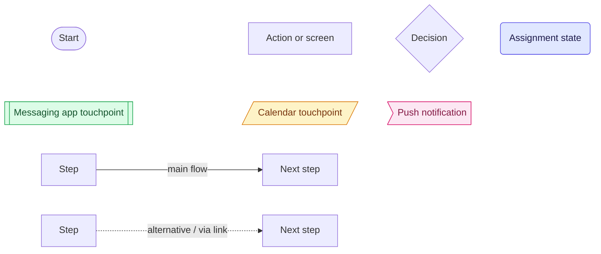
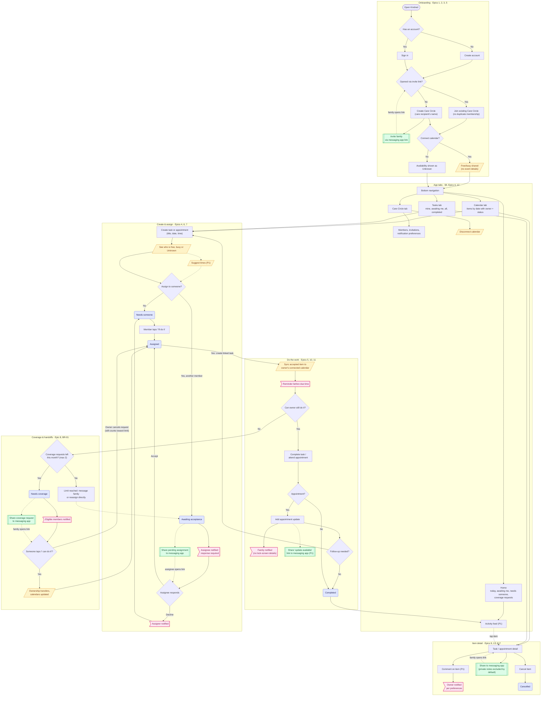

# Kindred — MVP User Flow

Derived from [PRD.md](PRD.md). Each group in the chart is labelled with the PRD epics it covers; features marked **(P1)** are post-P0 per §32 MVP Prioritization.

## Key

## Flow

## Epic coverage

| PRD section | Where it appears |
| --- | --- |
| Epic 1 — Accounts | Onboarding |
| Epic 2 — Care Circles | Onboarding |
| Epic 3 — Invitations | Onboarding, Care Circle tab |
| Epic 4 — Shared calendar | Calendar tab, Create & assign |
| Epic 5 — Calendar integration | Onboarding, Care Circle tab, Do the work, Coverage |
| Epic 6 — Availability | Onboarding, Create & assign |
| Epic 7 — Tasks & assignment | Create & assign, Do the work |
| Epic 8 — Coverage | Coverage & handoffs |
| Epic 9 — Messaging app sharing | Green nodes throughout |
| Epic 10 — Appointment updates | Do the work |
| Epic 11 — Notifications | Pink nodes throughout, Care Circle tab |
| Epic 12 — Activity feed | App tabs, Item detail |
| Epic 13 — Comments | Item detail |
| §17 — Assignment states | Blue rounded nodes |
